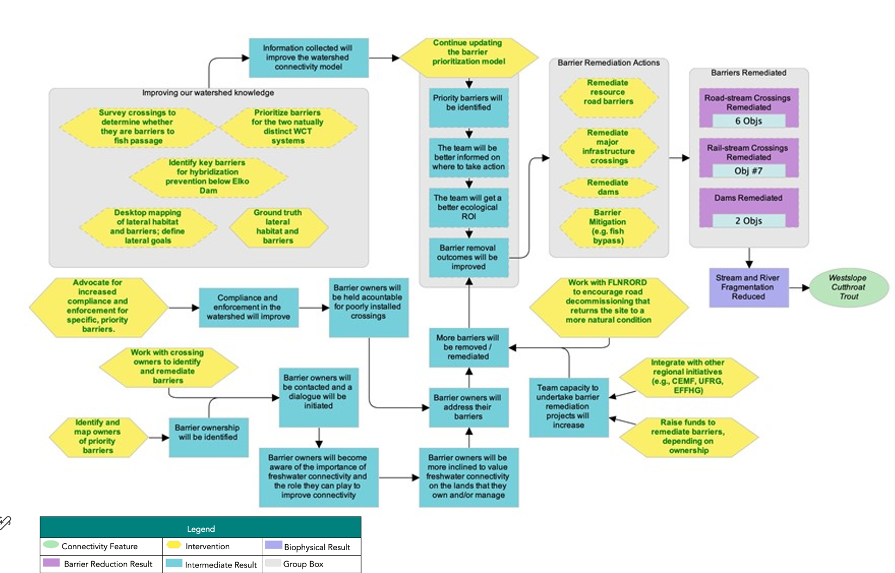
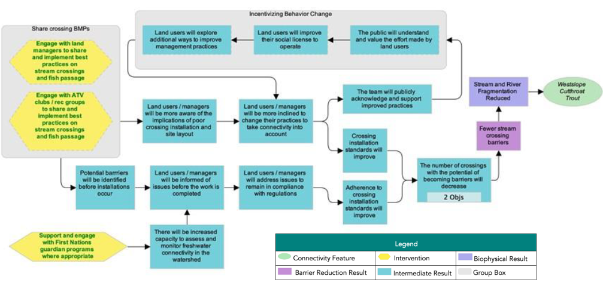

# Appendix C – Situation Analys, Strategies, Actions, and Theories of Change {-}

The following situation model was developed by the planning team to “map” the project context and brainstorm potential actions for implementation. Green text is used to identify actions that were selected for implementation (Table 16), and red text is used to identify actions that the project team has decided to exclude from the current iteration of the plan, given that they were either outside of the project scope or were deemed to be ineffective by the planning team. 


```{r workplan, echo = FALSE, results = 'asis'}
#| label: table-16
#| tbl-cap: "Effectiveness evaluation of identified conservation strategies and associated actions to improve connectivity for Westslope Cutthroat Trout in the Elk River watershed (Qukin ?amak?is). The Planning Team identified two broad strategies to implement through this WCRP: (1) barrier rehabilitation and (2) barrier prevention. Individual actions were qualitatively evaluated based on the anticipated effect each action will have on realizing on-the-ground gains in connectivity. Effectiveness ratings are based on a combination of "Feasibility" and "Impact", Feasibility is defined as the degree to which the project team can implement the action within realistic constraints (financial, time, ethical, etc.) and Impact is the degree to which the action is likely to contribute to achieving one or more of the goals established in this plan.<br> Strategy 1: Barrier Rehabilitation "
#| warning: false
#| echo: false
source("Rscripts/table_formatting.R")
library("flextable")

data <- read.csv("data/strategy-barrier-remediation.csv", check.names=FALSE)
ft <- flextable(data)
ft <- format_flextable(ft)
ft
```

```{r workplan, echo = FALSE, results = 'asis'}
#| label: table-17
#| tbl-cap: "Strategy 2: Barrier Prevention"
#| warning: false
#| echo: false
source("Rscripts/table_formatting.R")
library("flextable")

data <- read.csv("data/strategy-barrier-prevention.csv", check.names=FALSE)
ft <- flextable(data)
ft <- format_flextable(ft)
ft
```

Theories of Change are explicit assumptions about how the identified actions will achieve gains in connectivity and contribute towards reaching the goals of the plan. To develop Theories of Change, the Planning Team developed explicit assumptions for each strategy which helped to clarify the rationale used for undertaking actions and provided an opportunity for feedback on invalid assumptions or missing opportunities. The Theories of Change are results-oriented and clearly define the expected outcome. The following theory of change models were developed by the WCRP Planning Team to “map” the causal (“if-then”) progression of assumptions of how the actions within a strategy work together to achieve project goals. 



