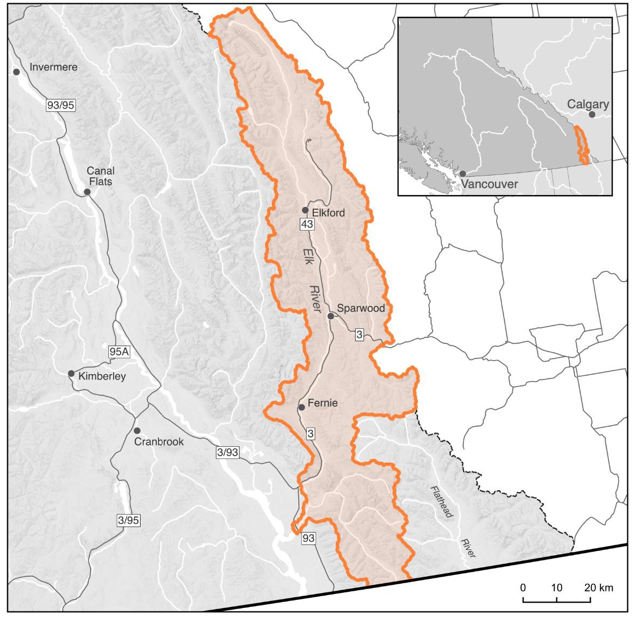

# Introduction {-}

## Purpose{-}

This 30-year plan was developed to identify priority actions that the Elk River (Qukin ?amak?is) WCRP Planning Team will undertake between 2021-2041 to conserve and restore fish passage in the watershed through strategies aimed at barrier rehabilitation and barrier prevention. 

WCRPs are long-term, actionable plans that blend local stakeholder and rightsholder knowledge with innovative geographic information system (GIS) analyses to gain a shared understanding of where restoration efforts will have the greatest benefit for fish. The planning process is inspired by the Conservation Standards (v.4.0), which is a conservation planning framework that allows Planning Teams to systematically identify, implement, and monitor strategies to apply the most effective solutions to high-priority conservation problems. There is a rich history of fish and fish habitat conservation and restoration work in Qukin ?amak?is that this WCRP builds upon, including the work undertaken by the Yaq̓it ʔa·knuqⱡi’it First Nation, the Ktunaxa Nation, local non-profit organizations, the Province of British Columbia, and industry proponents, among others. The Canadian Wildlife Federation will continue to engage and coordinate with local partners and existing initiatives, including the Elk Valley Cumulative Effects Management Framework, the Elk Valley Fish and Fish Habitat Committee, and the Elk River Watershed Collaborative Monitoring Program. 

The Planning Team compiled existing barrier location and assessment data, habitat data, and previously-identified priorities, and combined this with local knowledge to create a strategic watershed-scale plan to improve connectivity. To expand on this work, the WCRP Planning Team defined the thematic scope of freshwater connectivity and refined the geographic scope to those portions of the watershed where barrier prioritization would be conducted and subsequent rehabilitation efforts will take place.  

Local data and knowledge are combined with connectivity modelling to estimate current connectivity status and identify structures that potentially block the most habitat. This informs the prioritization of field assessments to close the most significant knowledge gaps efficiently. Information from field assessments of barrier status and habitat condition are incorporated into a GIS-based model, improving understanding of which barriers block the most habitat. 

This information is also used to inform and plan restoration efforts. Structure rankings inform restoration prioritization by summarizing what is known about fragmentation and showing the relative amount of habitat upstream of each barrier. Actual prioritization of restoration activities is a social decision that requires additional information, including the quality and condition of upstream habitat, the cultural importance of different areas within the watershed, and the costs and logistics of addressing each barrier relative to the ecological benefits of doing so.  

As knowledge gaps are closed and barriers are addressed, this plan is revised to summarize progress and provide updated estimates of connectivity status and the status and relative importance of remaining structures. 


## Vision Statement {-}

Healthy, well-connected streams and rivers within the Elk River watershed (Qukin ?amak?is) support thriving populations of Westslope Cutthroat Trout. Watershed users work together to mitigate the negative impacts of aquatic barriers, improving the resiliency of streams and rivers for the benefit and appreciation of all. 


## Scope {-}

This WCRP focuses on habitat connectivity for Westslope Cutthroat Trout in the Qukin ?amak?is (Figure 5). The watershed is divided into those portions of the Elk River and its tributaries located upstream of the Elko dam, located between Fernie and Cranbrook, BC and those portions of the watershed located downstream of the dam. In addition, the Flathead River, which originates in Qukin ?amak?is to the east of the Elk River but empties into the Columbia River south of the border in Montana (and thus does not have any hydrological connection to the Elk River) is excluded from the geographic scope.  

Model outputs include an estimate of the current connectivity status along with structure ranks and counts for those portions of the watersheds upstream of Elko Dam and those portions located downstream of the dam. The model takes into consideration those portions of the watershed that are expected to support spawning or rearing habitat (or both) for Westslope Cutthroat Trout and determines the longest fragments of habitat that could be connected through removal of man-made structures, including all types of dams and stream crossings, though Elko Dam is excluded from the model as a focal structure due to its function in preventing introgression and the spread of aquatic invasive species upstream (see Focal Species: Westslope Cutthroat Trout | Oncorhynchus clarkii lewisi), and the presence of a historic natural barrier at this site.  

This plan is intended to focus on the direct rehabilitation and prevention of localized, physical barriers instead of the broad land-use patterns that are causing chronic connectivity issues in the watershed. The Planning Team decided that the primary focus of this WCRP is addressing barriers to longitudinal connectivity (i.e., along the upstream-downstream plane) due to the magnitude of the threat posed by linear development (i.e., road and rail lines) in the watershed. In Qukin ?amak?is, an additional connectivity consideration is identifying barriers that should not be rehabilitated to protect genetically pure Westslope Cutthroat Trout populations and mitigate the threat of introgression due to aquatic invasive species.Natural barriers that could be managed to increase fish passage (i.e., waterfalls and beaver dams) are not the focus of this plan and are therefore not included as structures in connectivity models. Diffuse natural barriers that make entire areas impassible are not included in the models but may be used to define the scope of this WCRP. For example, a tributary that is inhospitable because it has been permanently altered by mining may be excluded from the overall spatial scope of the WCRP because restoration needs there are broader than connectivity.

{fig-cap-location="top"}


## Focal species: Westslope Cutthroat Trout | Oncorhynchus clarkii lewisi {-}

Westslope Cutthroat Trout is a cultural and ecological keystone species in Qukin ?amak?is, playing an important role in structuring aquatic ecosystems and contributing to nutrient recovery for riparian vegetation and forests in coldwater streams and lakes, including small, steep streams not accessible to other fish species (Willson & Halupka (1995), COSEWIC (2016)). Westslope Cutthroat Trout are a traditionally important species for the Ktunaxa People and provide substantial economic value for recreational and commercial fisheries. Populations have declined in recent decades due to a combination of threats including introgressive hybridization with aquatic invasive species (particularly Rainbow Trout; O. mykiss), habitat degradation, fragmentation, overexploitation, and rising water temperatures due to climate change (COSEWIC (2016), Lamson (2018)). Most relevant to this WCRP, road networks have disrupted much of Qukin ?amak?is thereby increasing the density of stream crossings, leading to stream fragmentation and limiting upstream fish passage. Additionally, some entire headwater reaches have been disrupted or have disappeared due to rock drains associated with mining activity in the watershed (COSEWIC (2016)). 

```{r wctrout, echo = FALSE, results = 'asis'}
#| label: tbl-wctrout
#| tbl-cap: "Westslope Cutthroat Trout Pacific populations Designated Unit assessment. Assessments undertaken by the Committee on the Status of Endangered Wildlife in Canada (2016)."
#| warning: false
#| echo: false
source("Rscripts/table_formatting.R")
library("flextable")

data <- read.csv("data/wctrout-pop-assess-elkr-cosewic-2016.csv", check.names=FALSE)
ft <- flextable(data)
ft <- format_flextable(ft)
ft
```

Westslope Cutthroat Trout populations and subpopulations found in Qukin ?amak?is are captured by the “Pacific populations” Designated Unit as defined by the Committee on the Status of Endangered Wildlife in Canada (COSEWIC), which has a core distribution covering the upper Kootenay River drainage (Table 1). Specifically, Qukin ?amak?is contains the Elk River and Upper Kootenay population groups, with each population group containing multiple sub-populations with variable life history forms (Table 2). High levels of hybridization exist in most waterbodies connected to the Koocanusa Reservoir (i.e., the Upper Kootenay population group), including the Elk River mainstem downstream of the Elko Dam and much of the Wigwam and Lodgepole systems. Generally, the hybridization levels upstream of Elko Dam are quite low, though there is known hybridization occurring in the Michel Creek sub-drainage (COSEWIC (2016); H. Lamson, BC Ministry of Environment pers. comm.). Pure Westslope Cutthroat Trout sub-populations exist in the upper Fording River (upstream of Josephine Falls), Greenhills Creek, Forsyth Creek, Grave Creek, Harmer Creek, Morrissey Creek, Weary Creek, upper Lodgepole Creek, and the upper Elk River (Lamson (2018)). 

```{r popdetails, echo = FALSE, results = 'asis'}
#| label: tbl-wcrp-pop
#| tbl-cap: "Population group details for each WCRP Unit - Upstream and Downstream of the Elko Dam - in the Elk River watershed (COSEWIC 2016, Lamson 2018)."
#| warning: false
#| echo: false
source("Rscripts/table_formatting.R")
library("flextable")

data <- read.csv("data/pop-details-wcrp-cosewic-2016.csv", check.names=FALSE)
ft <- flextable(data)
ft <- format_flextable(ft)
ft
```

Adult Westslope Cutthroat Trout overwinter in deep pools or lakes and then generally move upstream to spawning habitat during high spring flows, with spawning peaking between May and June. Fry emergence occurs between July and August, with individuals migrating to lower velocity rearing habitats in and around natal streams (@Cosewic2016-qf, @ERA). Westslope Cutthroat Trout exist with three distinct life history forms in the Elk River watershed (@Oliver2009, @ERA):

- Stream-resident — individuals spend their entire life history within a restricted distribution of headwater streams, often because movement is restricted by natural barriers.

- Fluvial — individuals migrate between tributaries and larger mainstem rivers to complete various life-history stages (e.g., spawning, overwintering).

- Adfluvial — individuals migrate between tributaries and lakes/reservoirs to complete life-history stages. See Appendix A for maps of modelled Westslope Cutthroat Trout habitat in the Elk River watershed.

## Barrier Types {-}

The following table highlights which barrier types pose the greatest threat to Westslope Cutthroat Trout in the watershed. The results of this assessment were used to inform the subsequent planning steps, as well as to identify knowledge gaps where there are little spatial data to inform the assessment for a specific barrier type.


```{python barriertype, echo=FALSE}
#| label: tbl-barriertype
#| tbl-cap: "Barrier types in the Elk River watershed and barrier rating assessment results. For each barrier type listed, 'Extent' refers to the proportion of Westslope Cutthroat Trout habitat that is being blocked by that barrier type, 'Severity' is the proportion of structures for each barrier type that are known to block passage for focal species based on field assessments, and 'Irreversibility' is the degree to which the effects of a barrier type can be reversed and connectivity restored."
#| warning: false
#| echo: false


from ipywidgets import *
import pandas as pd
import warnings

warnings.filterwarnings('ignore')


            

df = pd.DataFrame({"Barrier Types":["Dams","Road-Stream Crossings","Rail-stream Crossings","Trail-stream Crossings","Lateral Barriers","Sediment Wedges", "Landslides"],
                   "Extent":["Low","Very High","Low", "Low","Low","Low","Low"],
                   "Severity":["Very High","High","High", "Low", "Low","Low","Low"],
                   "Irreversibility":["High","Medium","High","Low","High", "Medium", "High"],
                   "Overall Threat Rating:":["Low","High","Medium","Low","Low", "Low", "Low"]
                   }).style.set_properties(subset=["Overall Threat Rating:"], **{'font-weight': 'bold'})

def highlight(val):
    red = '#ff0000;'
    yellow = '#ffff00;'
    lgreen = '#92d050;'
    dgreen = '#03853e;'

    if val=="Very High": color = red
    elif val=="High": color = yellow
    elif val=="Medium": color = lgreen
    elif val =="Low": color = dgreen
    else: color = 'white'
    return 'background-color: %s' % color

#df = df.style.set_properties(subset=["Overall Threat Rating"], **{'font-weight': 'bold'})

data = df.applymap(highlight).hide()

data.set_table_styles(
   [{
       'selector': 'th',
       'props': [('background-color', '#008270'),('text-align', 'left')]
   }])

```


### Dams {-}

With the exception of Elko Dam, which is excluded from the project scope due to the historic natural barrier at the site, as well as its function in preventing aquatic invasive species movements, there are only a small number of known dams in Qukin ?amak?is, mostly associated with mining activity (e.g., settling/tailing ponds). The Harmer Creek Dam was identified by the Planning Team as an important dam to rehabilitate to benefit a genetically-pure Westslope Cutthroat Trout population in the Grave-Harmer system, and Elk Valley Resources (formerly Teck Resources Ltd.) is undertaking an assessment process to evaluate potential rehabilitation options (W. Franklin, Teck Resources Ltd., pers. comm.). There are no known fishways in the watershed, and the identified dams likely block passage for Westslope Cutthroat Trout.  

Although the severity of fragmentation is rated as Very High due to the impassable nature of dams, and the irreversibility is High due to the significant resources required to restore passage at dams, a final pressure rating of Low was assigned. 


### Road-stream Crossings {-}

Road-stream crossings are the most abundant barrier type in Qukin ?amak?is. Significant land use and linear development throughout the valley bottom, including Highways 3 and 43, have disconnected the Elk River from important habitat in many tributaries. The resource road-stream crossings are primarily associated with mining and forestry activities in the watershed. The collective experience and input from the Planning Team resulted in a Medium irreversibility rating due to the technical complexity and resources required to rehabilitate road-stream crossings, though it was noted that this differs considerably between resource roads and highway crossings. 


### Rail-stream crossings {-}

There are relatively few rail-stream crossings in Qukin ?amak?is. All rail- stream crossings are associated with the CPKC rail lines running along the Elk River, Fording River, and Michel Creek. Given the significant financial costs, technical challenges, and barrier owner engagement required to rehabilitate these barriers, the Planning Team decided on an overall threat rating of Medium for this barrier type. 


### Trail-stream crossings {-}

There are very little spatial data available on trail-stream crossings in Qukin ?amak?is, so the Planning Team was unable to numerically quantify the Extent and Severity of this barrier type. The Planning Team felt that recreational trail network crossings rarely significantly block passage for Westslope Cutthroat Trout. Given that most crossings will likely be fords or similar structures, the rehabilitation costs associated with these barriers would be quite low. Overall, the Planning Team felt that the threat rating for trail-stream crossings was likely Low. 


### Lateral Barriers {-}

There are numerous types of lateral barriers that potentially occur in Qukin ?amak?is, including dykes, berms, and linear development (i.e., road and rail lines), all of which can restrict the ability of Westslope Cutthroat Trout to move into floodplains, riparian wetlands, and other off-channel habitats. No comprehensive lateral barrier data exist within the watershed, so threat ratings were based on qualitative local knowledge. Lateral barriers are not thought to be as prevalent as road- or rail-stream crossings and are likely to be passable for at least certain parts of the year where they do exist. Highway 3, Highway 43, and the CPKC rail line were identified as potential lateral barriers that disconnect the mainstem channels from their historic floodplain and off-channel habitat. Overall, the Planning Team decided that a Low threat rating adequately captured the effect that lateral barriers are having on connectivity in the watershed, while recognizing that the lack of data on lateral barriers in the watershed is an important knowledge gap to fill. 


### Sediment Wedges {-}

Sediment wedges include both mass wasting events and chronic bank erosion that can lead to the deposition of sediment to such an extent as to limit fish passage. The extent and severity of sediment wedges acting as barriers fluctuates seasonally and annually due to natural and human-induced changes to the flow regime, and natural barriers of this type are difficult to include in a spatial prioritization framework due to their transient nature. Both current and historic land-use practices, including mining and forest-harvesting impacts, contribute to the formation of sediment wedges in Qukin ?amak?is; however, the Planning Team felt that the extent and severity were Low overall. 


### Landslides {-}

Though a relatively rare occurrence, landslides that result in impediments to fish passage do occur in Qukin ?amak?is and can be technically and financially difficult to rehabilitate when they occur. Overall, the Planning Team felt that a Low rating adequately captured the effects of landslides but felt that it was an important barrier type to identify in this WCRP. 

