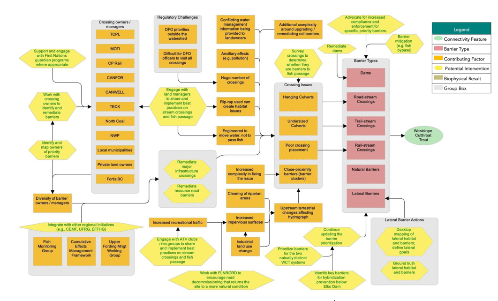
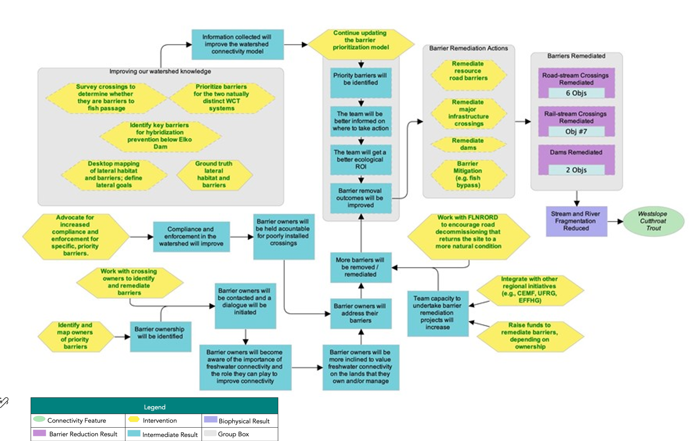
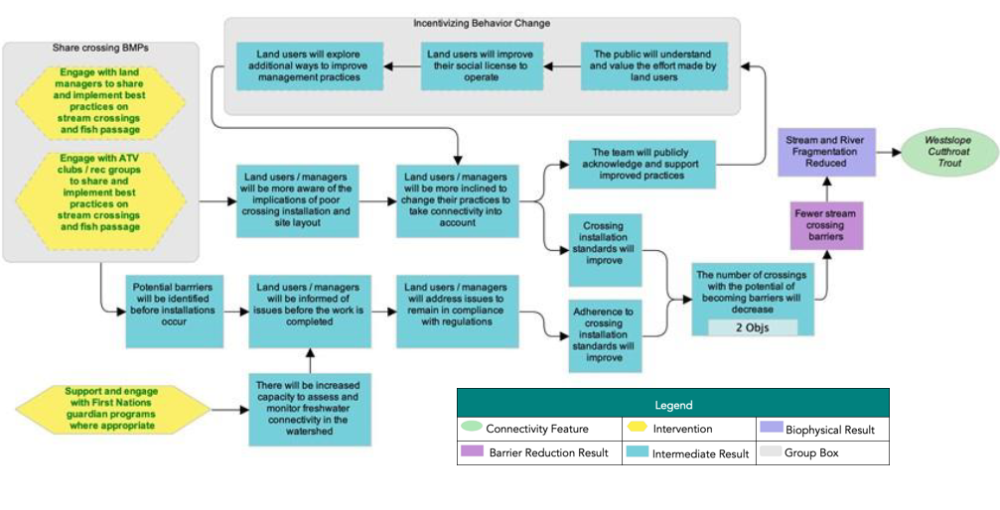

::: {.cell}

:::


# Supplementary Information {-}

## Situation Analysis {-}

The following situation model was developed by the planning team to “map” the project context and brainstorm potential actions for implementation. Green text is used to identify actions that were selected for implementation (see 'Strategies & Actions'), and red text is used to identify actions that the project team has decided to exclude from the current iteration of the plan, given that they were either outside of the project scope or were deemed to be ineffective by the planning team.

{#fig-sitan}

## Strategies & Actions {-}

Effectiveness evaluation of identified conservation strategies and associated actions to improve connectivity for Westslope Cutthroat Trout in the Elk River watershed. The planning team identified two broad strategies to implement through this WCRP, 1) barrier remediation and 2) barrier prevention. Individual actions were qualitatively evaluated based on the anticipated effect each action will have on realizing on-the-ground gains in connectivity. Effectiveness ratings are based on a combination of "Feasibility" and "Impact", Feasibility is defined as the degree to which the project team can implement the action within realistic constraints (financial, time, ethical, etc.) and Impact is the degree to which the action is likely to contribute to achieving one or more of the goals established in this plan.

## Strategy 1: Barrier Remediation {-}


::: {#tbl-S1 .cell tbl-cap='Strategy 1'}
::: {.cell-output-display}


```{=html}
<style type="text/css">
#T_09258 th {
  background-color: #008270;
  text-align: left;
}
#T_09258_row0_col0, #T_09258_row0_col1, #T_09258_row0_col2, #T_09258_row1_col0, #T_09258_row1_col1, #T_09258_row1_col2, #T_09258_row2_col0, #T_09258_row2_col1, #T_09258_row2_col2, #T_09258_row3_col0, #T_09258_row3_col1, #T_09258_row3_col2, #T_09258_row4_col0, #T_09258_row4_col1, #T_09258_row4_col2, #T_09258_row5_col0, #T_09258_row5_col1, #T_09258_row5_col2, #T_09258_row6_col0, #T_09258_row6_col1, #T_09258_row6_col2, #T_09258_row7_col0, #T_09258_row7_col1, #T_09258_row7_col2, #T_09258_row8_col0, #T_09258_row8_col1, #T_09258_row8_col2, #T_09258_row9_col0, #T_09258_row9_col1, #T_09258_row9_col2, #T_09258_row10_col0, #T_09258_row10_col1, #T_09258_row10_col2, #T_09258_row10_col3, #T_09258_row10_col4, #T_09258_row11_col0, #T_09258_row11_col1, #T_09258_row11_col2, #T_09258_row12_col0, #T_09258_row12_col1, #T_09258_row12_col2, #T_09258_row13_col0, #T_09258_row13_col1, #T_09258_row13_col2, #T_09258_row14_col0, #T_09258_row14_col1, #T_09258_row14_col2, #T_09258_row14_col3, #T_09258_row14_col4, #T_09258_row15_col0, #T_09258_row15_col1, #T_09258_row15_col2, #T_09258_row15_col3, #T_09258_row15_col4, #T_09258_row16_col0, #T_09258_row16_col1, #T_09258_row16_col2, #T_09258_row16_col3, #T_09258_row16_col4 {
  background-color: white;
  text-align: left;
}
#T_09258_row0_col3, #T_09258_row0_col5, #T_09258_row3_col4, #T_09258_row4_col3, #T_09258_row4_col4, #T_09258_row4_col5, #T_09258_row5_col4, #T_09258_row5_col5, #T_09258_row8_col3, #T_09258_row8_col5, #T_09258_row11_col3, #T_09258_row11_col4, #T_09258_row11_col5 {
  background-color: #03853e;
  text-align: left;
}
#T_09258_row0_col4, #T_09258_row1_col4, #T_09258_row2_col4, #T_09258_row5_col3, #T_09258_row6_col3, #T_09258_row6_col4, #T_09258_row6_col5, #T_09258_row7_col3, #T_09258_row7_col4, #T_09258_row7_col5, #T_09258_row8_col4, #T_09258_row9_col3, #T_09258_row9_col4, #T_09258_row9_col5, #T_09258_row12_col3, #T_09258_row12_col4, #T_09258_row12_col5, #T_09258_row13_col3, #T_09258_row13_col4, #T_09258_row13_col5 {
  background-color: #92d050;
  text-align: left;
}
#T_09258_row1_col3, #T_09258_row1_col5, #T_09258_row2_col3, #T_09258_row2_col5, #T_09258_row3_col3, #T_09258_row3_col5, #T_09258_row10_col5, #T_09258_row14_col5, #T_09258_row15_col5, #T_09258_row16_col5 {
  background-color: #ffff00;
  text-align: left;
}
</style>
<table id="T_09258">
  <thead>
    <tr>
      <th id="T_09258_level0_col0" class="col_heading level0 col0" >ID</th>
      <th id="T_09258_level0_col1" class="col_heading level0 col1" >Actions</th>
      <th id="T_09258_level0_col2" class="col_heading level0 col2" >Details</th>
      <th id="T_09258_level0_col3" class="col_heading level0 col3" >Feasibility</th>
      <th id="T_09258_level0_col4" class="col_heading level0 col4" >Impact</th>
      <th id="T_09258_level0_col5" class="col_heading level0 col5" >Effectiveness</th>
    </tr>
  </thead>
  <tbody>
    <tr>
      <td id="T_09258_row0_col0" class="data row0 col0" >1.1</td>
      <td id="T_09258_row0_col1" class="data row0 col1" >Remediate resource road barriers</td>
      <td id="T_09258_row0_col2" class="data row0 col2" >This action represents some projects that would be led by the planning team with conservation funds (e.g., orphaned barriers or those owned by individuals), while other remediation projects would be the responsibility of the barrier owner. Industry will have to be engaged to successfully implement this intervention.</td>
      <td id="T_09258_row0_col3" class="data row0 col3" >High</td>
      <td id="T_09258_row0_col4" class="data row0 col4" >Very high</td>
      <td id="T_09258_row0_col5" class="data row0 col5" >Effective</td>
    </tr>
    <tr>
      <td id="T_09258_row1_col0" class="data row1 col0" >1.2</td>
      <td id="T_09258_row1_col1" class="data row1 col1" >Remediate dams</td>
      <td id="T_09258_row1_col2" class="data row1 col2" >Identify owners of dams that appear on the intermediate barrier lists (see Appendix C) and engage with them to explore technical and financial options.</td>
      <td id="T_09258_row1_col3" class="data row1 col3" >Medium</td>
      <td id="T_09258_row1_col4" class="data row1 col4" >Very high</td>
      <td id="T_09258_row1_col5" class="data row1 col5" >Need more information</td>
    </tr>
    <tr>
      <td id="T_09258_row2_col0" class="data row2 col0" >1.3</td>
      <td id="T_09258_row2_col1" class="data row2 col1" >Remediate major infrastructure crossings</td>
      <td id="T_09258_row2_col2" class="data row2 col2" >In most cases, the planning team will engage with barrier owners, but the owners of the barrier would be responsible for the financial cost of remediation. This includes building relationships with CP rail to open a two-way discussion on the scale, priority, and impact to their crossings on the watershed. Include the financial and ecological cost/benefits of remediation options in communication with infrastructure owners.</td>
      <td id="T_09258_row2_col3" class="data row2 col3" >Medium</td>
      <td id="T_09258_row2_col4" class="data row2 col4" >Very high</td>
      <td id="T_09258_row2_col5" class="data row2 col5" >Need more information</td>
    </tr>
    <tr>
      <td id="T_09258_row3_col0" class="data row3 col0" >1.4</td>
      <td id="T_09258_row3_col1" class="data row3 col1" >Barrier mititgation</td>
      <td id="T_09258_row3_col2" class="data row3 col2" >Examples may include installing fish ladders on barriers that cannot be remediated; however, temporary mitigation does not replace the need for barrier remediation and removal. There are specific cases where temporary fixes are appropriate, but we will focus on long-term solutions wherever possible.</td>
      <td id="T_09258_row3_col3" class="data row3 col3" >Medium</td>
      <td id="T_09258_row3_col4" class="data row3 col4" >High</td>
      <td id="T_09258_row3_col5" class="data row3 col5" >Need more information</td>
    </tr>
    <tr>
      <td id="T_09258_row4_col0" class="data row4 col0" >1.5</td>
      <td id="T_09258_row4_col1" class="data row4 col1" >Work with crossing owners to identify and remediate barriers</td>
      <td id="T_09258_row4_col2" class="data row4 col2" ></td>
      <td id="T_09258_row4_col3" class="data row4 col3" >High</td>
      <td id="T_09258_row4_col4" class="data row4 col4" >High</td>
      <td id="T_09258_row4_col5" class="data row4 col5" >Effective</td>
    </tr>
    <tr>
      <td id="T_09258_row5_col0" class="data row5 col0" >1.6</td>
      <td id="T_09258_row5_col1" class="data row5 col1" >Advocate for increased compliance and enforcement for specific, priority barriers</td>
      <td id="T_09258_row5_col2" class="data row5 col2" >Request provincial and/or federal agencies to require that targeted, high-priority barriers be remediated. This should be a last resort after working to engage barrier owners and ground-truthing the situation. It will be important to identify obstacles to applying compliance and enforcement measures in order to provide the appropriate information on these opportunities.</td>
      <td id="T_09258_row5_col3" class="data row5 col3" >Very high</td>
      <td id="T_09258_row5_col4" class="data row5 col4" >High</td>
      <td id="T_09258_row5_col5" class="data row5 col5" >Effective</td>
    </tr>
    <tr>
      <td id="T_09258_row6_col0" class="data row6 col0" >1.7</td>
      <td id="T_09258_row6_col1" class="data row6 col1" >Work with FLNRORD to encourage road decommissioning that returns sites to a more natural condition</td>
      <td id="T_09258_row6_col2" class="data row6 col2" >Encourage sharing and implementation of best practices for fish-passage-"friendly" road decommissioning.</td>
      <td id="T_09258_row6_col3" class="data row6 col3" >Very high</td>
      <td id="T_09258_row6_col4" class="data row6 col4" >Very high</td>
      <td id="T_09258_row6_col5" class="data row6 col5" >Very effective</td>
    </tr>
    <tr>
      <td id="T_09258_row7_col0" class="data row7 col0" >1.8</td>
      <td id="T_09258_row7_col1" class="data row7 col1" >Integrate with other regional initiatives</td>
      <td id="T_09258_row7_col2" class="data row7 col2" >Engage and pursue coordination and collaboration with existing initiatives, (e.g., Elk Valley Cumulative Effects Management Framework, the Upper Fording River Recovery Group, the Elk Valley Fish and Fish Habitat Committee, and terrestrial connectivity working groups).</td>
      <td id="T_09258_row7_col3" class="data row7 col3" >Very high</td>
      <td id="T_09258_row7_col4" class="data row7 col4" >Very high</td>
      <td id="T_09258_row7_col5" class="data row7 col5" >Very effective</td>
    </tr>
    <tr>
      <td id="T_09258_row8_col0" class="data row8 col0" >1.9</td>
      <td id="T_09258_row8_col1" class="data row8 col1" >Raise funds to remediate barriers (ownership dependent)</td>
      <td id="T_09258_row8_col2" class="data row8 col2" >Where appropriate, collaborate within the planning team to raise conservation funds for remediation projects. See “Funding Sources” for more information.</td>
      <td id="T_09258_row8_col3" class="data row8 col3" >High</td>
      <td id="T_09258_row8_col4" class="data row8 col4" >Very high</td>
      <td id="T_09258_row8_col5" class="data row8 col5" >Effective</td>
    </tr>
    <tr>
      <td id="T_09258_row9_col0" class="data row9 col0" >1.1</td>
      <td id="T_09258_row9_col1" class="data row9 col1" >Knowledge Gap: Assess barriers by applying the provincial fish passage framework</td>
      <td id="T_09258_row9_col2" class="data row9 col2" >The first three steps are, (1) barrier assessments, (2) habitat confirmations, and (3) remediation designs. Barrier assessment data should be captured in the PSCIS database, which is available to all partners.</td>
      <td id="T_09258_row9_col3" class="data row9 col3" >Very high</td>
      <td id="T_09258_row9_col4" class="data row9 col4" >Very high</td>
      <td id="T_09258_row9_col5" class="data row9 col5" >Very effective</td>
    </tr>
    <tr>
      <td id="T_09258_row10_col0" class="data row10 col0" >1.11</td>
      <td id="T_09258_row10_col1" class="data row10 col1" >Knowledge Gap: Identify key barriers for hybridization prevention below Elko Dam</td>
      <td id="T_09258_row10_col2" class="data row10 col2" >Barrier remediation below the Elko dam presents the potential increased risk of hybridization of genetically pure Westslope Cutthroat Trout populations due to reconnection to the Koocanusa Reservoir. As such, prior to any decision, a series of site assessments will need to be performed to assess the risk of hybridization. This action does not directly contribute to the goals, but implementation is necessary for the success of other actions. This strategy should be revisited with First Nations and government agents to determine whether it should be kept as a knowledge gap or if a different approach (i.e., to look at it from a watershed functionality perspective with less concern about hybridization risks) should be adopted.</td>
      <td id="T_09258_row10_col3" class="data row10 col3" ></td>
      <td id="T_09258_row10_col4" class="data row10 col4" ></td>
      <td id="T_09258_row10_col5" class="data row10 col5" >Need more information</td>
    </tr>
    <tr>
      <td id="T_09258_row11_col0" class="data row11 col0" >1.12</td>
      <td id="T_09258_row11_col1" class="data row11 col1" >Knowledge Gap: Identify and map owners of priority barriers</td>
      <td id="T_09258_row11_col2" class="data row11 col2" ></td>
      <td id="T_09258_row11_col3" class="data row11 col3" >High</td>
      <td id="T_09258_row11_col4" class="data row11 col4" >High</td>
      <td id="T_09258_row11_col5" class="data row11 col5" >Effective</td>
    </tr>
    <tr>
      <td id="T_09258_row12_col0" class="data row12 col0" >1.13</td>
      <td id="T_09258_row12_col1" class="data row12 col1" >Knowledge Gap: Prioritize barriers for the Upper Fording and Grave-Harmon populations</td>
      <td id="T_09258_row12_col2" class="data row12 col2" >Due to the importance of these genetically pure populations within the watershed, ensure that barriers within these systems are evaluated if they do not rank highly in initial barrier prioritization efforts.</td>
      <td id="T_09258_row12_col3" class="data row12 col3" >Very high</td>
      <td id="T_09258_row12_col4" class="data row12 col4" >Very high</td>
      <td id="T_09258_row12_col5" class="data row12 col5" >Very effective</td>
    </tr>
    <tr>
      <td id="T_09258_row13_col0" class="data row13 col0" >1.14</td>
      <td id="T_09258_row13_col1" class="data row13 col1" >Knowledge Gap: Continue updating the barrier prioritization model</td>
      <td id="T_09258_row13_col2" class="data row13 col2" >The model process will be finalized, and prioritizations will be updated as new information becomes available.</td>
      <td id="T_09258_row13_col3" class="data row13 col3" >Very high</td>
      <td id="T_09258_row13_col4" class="data row13 col4" >Very high</td>
      <td id="T_09258_row13_col5" class="data row13 col5" >Very effective</td>
    </tr>
    <tr>
      <td id="T_09258_row14_col0" class="data row14 col0" >1.15</td>
      <td id="T_09258_row14_col1" class="data row14 col1" >Knowledge Gap: Desktop mapping of lateral habitat and barriers; define lateral connectivity goals</td>
      <td id="T_09258_row14_col2" class="data row14 col2" >This action does not directly contribute to the current goals, but setting lateral goals is a priority. Lateral barriers are considered a low threat in the Elk valley, however work on a provincial scale is underway to determine the impact of rail lines on lateral habitats.</td>
      <td id="T_09258_row14_col3" class="data row14 col3" ></td>
      <td id="T_09258_row14_col4" class="data row14 col4" ></td>
      <td id="T_09258_row14_col5" class="data row14 col5" >Need more information</td>
    </tr>
    <tr>
      <td id="T_09258_row15_col0" class="data row15 col0" >1.16</td>
      <td id="T_09258_row15_col1" class="data row15 col1" >Knowledge gap: Ground truth lateral habitat and barriers</td>
      <td id="T_09258_row15_col2" class="data row15 col2" >This action does not directly contribute to the current goals, but is an important step following action 1.15.</td>
      <td id="T_09258_row15_col3" class="data row15 col3" ></td>
      <td id="T_09258_row15_col4" class="data row15 col4" ></td>
      <td id="T_09258_row15_col5" class="data row15 col5" >Need more information</td>
    </tr>
    <tr>
      <td id="T_09258_row16_col0" class="data row16 col0" >1.17</td>
      <td id="T_09258_row16_col1" class="data row16 col1" >Knowledge gap: Monitor temperature and flows; assess effectiveness of barrier remediation projects</td>
      <td id="T_09258_row16_col2" class="data row16 col2" >Effectiveness monitoring study design (Lotic) for remediation sites. $35K monitoring equipment for ERA (CNFASAR).</td>
      <td id="T_09258_row16_col3" class="data row16 col3" ></td>
      <td id="T_09258_row16_col4" class="data row16 col4" ></td>
      <td id="T_09258_row16_col5" class="data row16 col5" >Need more information</td>
    </tr>
  </tbody>
</table>

```


:::
:::


## Strategy 2: Barrier Prevention {-}


::: {#tbl-S2 .cell tbl-cap='Strategy 2'}
::: {.cell-output-display}


```{=html}
<style type="text/css">
#T_63adb th {
  background-color: #008270;
  text-align: left;
}
#T_63adb_row0_col0, #T_63adb_row0_col1, #T_63adb_row0_col2, #T_63adb_row1_col0, #T_63adb_row1_col1, #T_63adb_row1_col2, #T_63adb_row2_col0, #T_63adb_row2_col1, #T_63adb_row2_col2 {
  background-color: white;
  text-align: left;
}
#T_63adb_row0_col3, #T_63adb_row0_col4, #T_63adb_row0_col5, #T_63adb_row1_col4, #T_63adb_row1_col5, #T_63adb_row2_col3 {
  background-color: #03853e;
  text-align: left;
}
#T_63adb_row1_col3 {
  background-color: #92d050;
  text-align: left;
}
#T_63adb_row2_col4, #T_63adb_row2_col5 {
  background-color: #ff0000;
  text-align: left;
}
</style>
<table id="T_63adb">
  <thead>
    <tr>
      <th id="T_63adb_level0_col0" class="col_heading level0 col0" >ID</th>
      <th id="T_63adb_level0_col1" class="col_heading level0 col1" >Actions</th>
      <th id="T_63adb_level0_col2" class="col_heading level0 col2" >Details</th>
      <th id="T_63adb_level0_col3" class="col_heading level0 col3" >Feasibility</th>
      <th id="T_63adb_level0_col4" class="col_heading level0 col4" >Impact</th>
      <th id="T_63adb_level0_col5" class="col_heading level0 col5" >Effectiveness</th>
    </tr>
  </thead>
  <tbody>
    <tr>
      <td id="T_63adb_row0_col0" class="data row0 col0" >2.1</td>
      <td id="T_63adb_row0_col1" class="data row0 col1" >Engage with land managers to share and implement best practices on stream crossings and fish passage</td>
      <td id="T_63adb_row0_col2" class="data row0 col2" >This should include encouraging better consultation before crossings are installed in the first place.</td>
      <td id="T_63adb_row0_col3" class="data row0 col3" >High</td>
      <td id="T_63adb_row0_col4" class="data row0 col4" >High</td>
      <td id="T_63adb_row0_col5" class="data row0 col5" >Effective</td>
    </tr>
    <tr>
      <td id="T_63adb_row1_col0" class="data row1 col0" >2.2</td>
      <td id="T_63adb_row1_col1" class="data row1 col1" >Support and engage with First Nations guardians programs where appropriate</td>
      <td id="T_63adb_row1_col2" class="data row1 col2" >This could include approaching KNC about their existing guardian program.</td>
      <td id="T_63adb_row1_col3" class="data row1 col3" >Very high</td>
      <td id="T_63adb_row1_col4" class="data row1 col4" >High</td>
      <td id="T_63adb_row1_col5" class="data row1 col5" >Effective</td>
    </tr>
    <tr>
      <td id="T_63adb_row2_col0" class="data row2 col0" >2.3</td>
      <td id="T_63adb_row2_col1" class="data row2 col1" >Engage with ATV clubs/recreation groups to share and implement best practices on stream crossings and fish passage</td>
      <td id="T_63adb_row2_col2" class="data row2 col2" >Trail-stream crossings have a low extent and severity in the watershed, and it is unlikely that ATV groups are creating barriers to fish passage.</td>
      <td id="T_63adb_row2_col3" class="data row2 col3" >High</td>
      <td id="T_63adb_row2_col4" class="data row2 col4" >Low</td>
      <td id="T_63adb_row2_col5" class="data row2 col5" >Not Effective</td>
    </tr>
  </tbody>
</table>

```


:::
:::


## Theories of Change & Objectives {-}

Theories of Change are explicit assumptions around how the identified actions will achieve gains in connectivity and contribute towards reaching the goals of the plan. To develop Theories of Change, the planning team developed explicit assumptions for each strategy which helped to clarify the rationale used for undertaking actions and provided an opportunity for feedback on invalid assumptions or missing opportunities. The Theories of Change are results oriented and clearly define the expected outcome. The following theory of change models were developed by the WCRP planning team to “map” the causal (“if-then”) progression of assumptions of how the actions within a strategy work together to achieve project goals.

{#fig-stra1}

{#fig-stra2}


## Operational Plan {-}

The operational plan represents a preliminary exercise undertaken by the planning team to identify the potential leads, potential participants, and estimated cost for the implementation of each action in the Elk River watershed. Table 8 summarizes individuals, groups, or organizations that the planning team felt could lead or participate in the implementation of the plan and should be interpreted as the first step in on-going planning and engagement to develop more detailed plan for entries into this table. The individuals, groups, and organizations listed under the "Lead(s)" or "Potential Participants" columns are those that provisionally expressed interest in participating in one of those roles or were suggested by the planning team for further engagement (denoted in parentheses), for those that are not members of the planning team. The leads, participants, and estimated costs in the operational plan are not binding nor an official commitment of resources, but rather provide a roadmap for future coordination and engagement to work towards implementation of the WCRP.


::: {#tbl-opplan .cell tbl-cap='Operational plan to support the implementation of strategies and actions to improve connectivity for target species in the Horsefly River watershed.'}
::: {.cell-output-display}


```{=html}
<style type="text/css">
#T_90bf1 th {
  background-color: #008270;
  text-align: left;
}
#T_90bf1_row0_col0, #T_90bf1_row0_col1, #T_90bf1_row0_col2, #T_90bf1_row0_col3, #T_90bf1_row18_col0, #T_90bf1_row18_col1, #T_90bf1_row18_col2, #T_90bf1_row18_col3, #T_90bf1_row22_col0, #T_90bf1_row22_col1, #T_90bf1_row22_col2, #T_90bf1_row22_col3, #T_90bf1_row23_col0, #T_90bf1_row23_col1, #T_90bf1_row23_col2, #T_90bf1_row23_col3, #T_90bf1_row24_col0, #T_90bf1_row24_col1, #T_90bf1_row24_col2, #T_90bf1_row24_col3 {
  background-color: black;
  color: white;
  text-align: left;
}
#T_90bf1_row1_col0, #T_90bf1_row1_col1, #T_90bf1_row1_col2, #T_90bf1_row1_col3, #T_90bf1_row2_col0, #T_90bf1_row2_col1, #T_90bf1_row2_col2, #T_90bf1_row2_col3, #T_90bf1_row3_col0, #T_90bf1_row3_col1, #T_90bf1_row3_col2, #T_90bf1_row3_col3, #T_90bf1_row4_col0, #T_90bf1_row4_col1, #T_90bf1_row4_col2, #T_90bf1_row4_col3, #T_90bf1_row5_col0, #T_90bf1_row5_col1, #T_90bf1_row5_col2, #T_90bf1_row5_col3, #T_90bf1_row6_col0, #T_90bf1_row6_col1, #T_90bf1_row6_col2, #T_90bf1_row6_col3, #T_90bf1_row7_col0, #T_90bf1_row7_col1, #T_90bf1_row7_col2, #T_90bf1_row7_col3, #T_90bf1_row8_col0, #T_90bf1_row8_col1, #T_90bf1_row8_col2, #T_90bf1_row8_col3, #T_90bf1_row9_col0, #T_90bf1_row9_col1, #T_90bf1_row9_col2, #T_90bf1_row9_col3, #T_90bf1_row10_col0, #T_90bf1_row10_col1, #T_90bf1_row10_col2, #T_90bf1_row10_col3, #T_90bf1_row11_col0, #T_90bf1_row11_col1, #T_90bf1_row11_col2, #T_90bf1_row11_col3, #T_90bf1_row12_col0, #T_90bf1_row12_col1, #T_90bf1_row12_col2, #T_90bf1_row12_col3, #T_90bf1_row13_col0, #T_90bf1_row13_col1, #T_90bf1_row13_col2, #T_90bf1_row13_col3, #T_90bf1_row14_col0, #T_90bf1_row14_col1, #T_90bf1_row14_col2, #T_90bf1_row14_col3, #T_90bf1_row15_col0, #T_90bf1_row15_col1, #T_90bf1_row15_col2, #T_90bf1_row15_col3, #T_90bf1_row16_col0, #T_90bf1_row16_col1, #T_90bf1_row16_col2, #T_90bf1_row16_col3, #T_90bf1_row17_col0, #T_90bf1_row17_col1, #T_90bf1_row17_col2, #T_90bf1_row17_col3, #T_90bf1_row19_col0, #T_90bf1_row19_col1, #T_90bf1_row19_col2, #T_90bf1_row19_col3, #T_90bf1_row20_col0, #T_90bf1_row20_col1, #T_90bf1_row20_col2, #T_90bf1_row20_col3, #T_90bf1_row21_col0, #T_90bf1_row21_col1, #T_90bf1_row21_col2, #T_90bf1_row21_col3 {
  text-align: left;
}
</style>
<table id="T_90bf1">
  <thead>
    <tr>
      <th id="T_90bf1_level0_col0" class="col_heading level0 col0" >Strategy / Actions</th>
      <th id="T_90bf1_level0_col1" class="col_heading level0 col1" >Lead(s) </th>
      <th id="T_90bf1_level0_col2" class="col_heading level0 col2" >Participants</th>
      <th id="T_90bf1_level0_col3" class="col_heading level0 col3" >Total Budget</th>
    </tr>
  </thead>
  <tbody>
    <tr>
      <td id="T_90bf1_row0_col0" class="data row0 col0" >Strategy 1: Crossing Remediation</td>
      <td id="T_90bf1_row0_col1" class="data row0 col1" ></td>
      <td id="T_90bf1_row0_col2" class="data row0 col2" ></td>
      <td id="T_90bf1_row0_col3" class="data row0 col3" >$16,137,390.00</td>
    </tr>
    <tr>
      <td id="T_90bf1_row1_col0" class="data row1 col0" >1.1 - Remediate resource road barriers</td>
      <td id="T_90bf1_row1_col1" class="data row1 col1" >CWF</td>
      <td id="T_90bf1_row1_col2" class="data row1 col2" ></td>
      <td id="T_90bf1_row1_col3" class="data row1 col3" >$8,500,000.00</td>
    </tr>
    <tr>
      <td id="T_90bf1_row2_col0" class="data row2 col0" >1.2 - Remediate dams</td>
      <td id="T_90bf1_row2_col1" class="data row2 col1" >CWF</td>
      <td id="T_90bf1_row2_col2" class="data row2 col2" ></td>
      <td id="T_90bf1_row2_col3" class="data row2 col3" >$435,000,000.00</td>
    </tr>
    <tr>
      <td id="T_90bf1_row3_col0" class="data row3 col0" >1.3 - Remediate major infrastructure crossings</td>
      <td id="T_90bf1_row3_col1" class="data row3 col1" ></td>
      <td id="T_90bf1_row3_col2" class="data row3 col2" >CWF</td>
      <td id="T_90bf1_row3_col3" class="data row3 col3" >$6,700,000.00</td>
    </tr>
    <tr>
      <td id="T_90bf1_row4_col0" class="data row4 col0" >1.4 - Barrier mititgation</td>
      <td id="T_90bf1_row4_col1" class="data row4 col1" >CWF, SERN</td>
      <td id="T_90bf1_row4_col2" class="data row4 col2" >CWF</td>
      <td id="T_90bf1_row4_col3" class="data row4 col3" >*Built-in to 1.1 and 1.2</td>
    </tr>
    <tr>
      <td id="T_90bf1_row5_col0" class="data row5 col0" >1.5 - Work with crossing owners to identify and remediate barriers</td>
      <td id="T_90bf1_row5_col1" class="data row5 col1" >Elk River Alliance (ERA)</td>
      <td id="T_90bf1_row5_col2" class="data row5 col2" >(Windsight), CWF</td>
      <td id="T_90bf1_row5_col3" class="data row5 col3" >$20,000</td>
    </tr>
    <tr>
      <td id="T_90bf1_row6_col0" class="data row6 col0" >1.6 - Advocate for increased compliance and enforcement for specific, priority barriers</td>
      <td id="T_90bf1_row6_col1" class="data row6 col1" >ERA</td>
      <td id="T_90bf1_row6_col2" class="data row6 col2" >(Windsight), CWF</td>
      <td id="T_90bf1_row6_col3" class="data row6 col3" >$20,000.00</td>
    </tr>
    <tr>
      <td id="T_90bf1_row7_col0" class="data row7 col0" >1.7 - Work with FLNRORD to encourage road decommissioning that returns sites to a more natural condition</td>
      <td id="T_90bf1_row7_col1" class="data row7 col1" >ERA</td>
      <td id="T_90bf1_row7_col2" class="data row7 col2" >(Windsight)</td>
      <td id="T_90bf1_row7_col3" class="data row7 col3" >$5,000.00</td>
    </tr>
    <tr>
      <td id="T_90bf1_row8_col0" class="data row8 col0" >1.8 - Integrate with other regional initiatives</td>
      <td id="T_90bf1_row8_col1" class="data row8 col1" >CWF</td>
      <td id="T_90bf1_row8_col2" class="data row8 col2" >ERA</td>
      <td id="T_90bf1_row8_col3" class="data row8 col3" >$25,000.00</td>
    </tr>
    <tr>
      <td id="T_90bf1_row9_col0" class="data row9 col0" >1.9 - Raise funds to remediate barriers (ownership dependent)</td>
      <td id="T_90bf1_row9_col1" class="data row9 col1" >CWF</td>
      <td id="T_90bf1_row9_col2" class="data row9 col2" ></td>
      <td id="T_90bf1_row9_col3" class="data row9 col3" >$200,000.00</td>
    </tr>
    <tr>
      <td id="T_90bf1_row10_col0" class="data row10 col0" >1.10 - Knowledge Gap: Assess barriers by applying the provincial fish passage framework</td>
      <td id="T_90bf1_row10_col1" class="data row10 col1" >CWF</td>
      <td id="T_90bf1_row10_col2" class="data row10 col2" ></td>
      <td id="T_90bf1_row10_col3" class="data row10 col3" >$84,890.00</td>
    </tr>
    <tr>
      <td id="T_90bf1_row11_col0" class="data row11 col0" >1.11 - Knowledge Gap: Identify key barriers for hybridization prevention below Elko Dam</td>
      <td id="T_90bf1_row11_col1" class="data row11 col1" ></td>
      <td id="T_90bf1_row11_col2" class="data row11 col2" >CWF</td>
      <td id="T_90bf1_row11_col3" class="data row11 col3" >$11,000.00</td>
    </tr>
    <tr>
      <td id="T_90bf1_row12_col0" class="data row12 col0" >1.12 - Knowledge Gap: Identify and map owners of priority barriers</td>
      <td id="T_90bf1_row12_col1" class="data row12 col1" >ERA</td>
      <td id="T_90bf1_row12_col2" class="data row12 col2" >CWF</td>
      <td id="T_90bf1_row12_col3" class="data row12 col3" >$1,500.00</td>
    </tr>
    <tr>
      <td id="T_90bf1_row13_col0" class="data row13 col0" >1.13 - Knowledge Gap: Prioritize barriers for the Upper Fording and Grave-Harmon populations</td>
      <td id="T_90bf1_row13_col1" class="data row13 col1" >CWF</td>
      <td id="T_90bf1_row13_col2" class="data row13 col2" ></td>
      <td id="T_90bf1_row13_col3" class="data row13 col3" >Completed</td>
    </tr>
    <tr>
      <td id="T_90bf1_row14_col0" class="data row14 col0" >1.14 - Knowledge Gap: Continue updating the barrier prioritization model</td>
      <td id="T_90bf1_row14_col1" class="data row14 col1" >CWF</td>
      <td id="T_90bf1_row14_col2" class="data row14 col2" ></td>
      <td id="T_90bf1_row14_col3" class="data row14 col3" >$50,000</td>
    </tr>
    <tr>
      <td id="T_90bf1_row15_col0" class="data row15 col0" >1.15 - Knowledge Gap: Desktop mapping of lateral habitat and barriers; define lateral connectivity goals</td>
      <td id="T_90bf1_row15_col1" class="data row15 col1" >ERA</td>
      <td id="T_90bf1_row15_col2" class="data row15 col2" >CWF</td>
      <td id="T_90bf1_row15_col3" class="data row15 col3" >$20,000.00</td>
    </tr>
    <tr>
      <td id="T_90bf1_row16_col0" class="data row16 col0" >1.16 - Knowledge gap: Ground truth lateral habitat and barriers</td>
      <td id="T_90bf1_row16_col1" class="data row16 col1" ></td>
      <td id="T_90bf1_row16_col2" class="data row16 col2" >CWF, ERA</td>
      <td id="T_90bf1_row16_col3" class="data row16 col3" >$65,000</td>
    </tr>
    <tr>
      <td id="T_90bf1_row17_col0" class="data row17 col0" >1.17 - Knowledge gap: Monitor temperature and flows; assess effectiveness of barrier remediation projects</td>
      <td id="T_90bf1_row17_col1" class="data row17 col1" >ERA</td>
      <td id="T_90bf1_row17_col2" class="data row17 col2" >CWF</td>
      <td id="T_90bf1_row17_col3" class="data row17 col3" >$50,000</td>
    </tr>
    <tr>
      <td id="T_90bf1_row18_col0" class="data row18 col0" >Strategy 2: Barrier Prevention</td>
      <td id="T_90bf1_row18_col1" class="data row18 col1" ></td>
      <td id="T_90bf1_row18_col2" class="data row18 col2" ></td>
      <td id="T_90bf1_row18_col3" class="data row18 col3" >$250,000.00</td>
    </tr>
    <tr>
      <td id="T_90bf1_row19_col0" class="data row19 col0" >2.1 - Engage with land managers to share and implement best practices on stream crossings and fish passage</td>
      <td id="T_90bf1_row19_col1" class="data row19 col1" >ERA</td>
      <td id="T_90bf1_row19_col2" class="data row19 col2" >CWF</td>
      <td id="T_90bf1_row19_col3" class="data row19 col3" >$100,000.00</td>
    </tr>
    <tr>
      <td id="T_90bf1_row20_col0" class="data row20 col0" >2.2 - Support and engage with First Nations guardians programs where appropriate</td>
      <td id="T_90bf1_row20_col1" class="data row20 col1" ></td>
      <td id="T_90bf1_row20_col2" class="data row20 col2" >CWF, KNC?</td>
      <td id="T_90bf1_row20_col3" class="data row20 col3" >$140,000.00</td>
    </tr>
    <tr>
      <td id="T_90bf1_row21_col0" class="data row21 col0" >2.3 - Engage with ATV clubs/recreation groups to share and implement best practices on stream crossings and fish passage</td>
      <td id="T_90bf1_row21_col1" class="data row21 col1" ></td>
      <td id="T_90bf1_row21_col2" class="data row21 col2" ></td>
      <td id="T_90bf1_row21_col3" class="data row21 col3" ></td>
    </tr>
    <tr>
      <td id="T_90bf1_row22_col0" class="data row22 col0" >Total:</td>
      <td id="T_90bf1_row22_col1" class="data row22 col1" ></td>
      <td id="T_90bf1_row22_col2" class="data row22 col2" ></td>
      <td id="T_90bf1_row22_col3" class="data row22 col3" >$17,024,140.00</td>
    </tr>
    <tr>
      <td id="T_90bf1_row23_col0" class="data row23 col0" >Fundraising total:</td>
      <td id="T_90bf1_row23_col1" class="data row23 col1" ></td>
      <td id="T_90bf1_row23_col2" class="data row23 col2" ></td>
      <td id="T_90bf1_row23_col3" class="data row23 col3" >$9,024,140</td>
    </tr>
    <tr>
      <td id="T_90bf1_row24_col0" class="data row24 col0" >Proponent/government contribution total:</td>
      <td id="T_90bf1_row24_col1" class="data row24 col1" ></td>
      <td id="T_90bf1_row24_col2" class="data row24 col2" ></td>
      <td id="T_90bf1_row24_col3" class="data row24 col3" >$8,000,000</td>
    </tr>
  </tbody>
</table>

```


:::
:::


## Funding Sources {-}


::: {#tbl-fund1 .cell tbl-cap='Confirmed funding sources for plan implementation in the Elk River watershed.'}


``````{=openxml}

<w:tbl xmlns:w="http://schemas.openxmlformats.org/wordprocessingml/2006/main" xmlns:r="http://schemas.openxmlformats.org/officeDocument/2006/relationships" xmlns:w14="http://schemas.microsoft.com/office/word/2010/wordml" xmlns:wp="http://schemas.openxmlformats.org/drawingml/2006/wordprocessingDrawing" xmlns:a="http://schemas.openxmlformats.org/drawingml/2006/main" xmlns:pic="http://schemas.openxmlformats.org/drawingml/2006/picture"><w:tblPr><w:tblLayout w:type="fixed"/><w:jc w:val="center"/><w:tblLook w:firstRow="1" w:lastRow="0" w:firstColumn="0" w:lastColumn="0" w:noHBand="0" w:noVBand="1"/></w:tblPr><w:tblGrid><w:gridCol w:w="5155"/><w:gridCol w:w="16126"/><w:gridCol w:w="1457"/></w:tblGrid><w:tr><w:trPr><w:trHeight w:val="617" w:hRule="auto"/><w:tblHeader/></w:trPr>header1<w:tc><w:tcPr><w:tcBorders><w:bottom w:val="single" w:sz="12" w:space="0" w:color="666666"/><w:top w:val="single" w:sz="12" w:space="0" w:color="666666"/><w:left w:val="none" w:sz="0" w:space="0" w:color="000000"/><w:right w:val="none" w:sz="0" w:space="0" w:color="000000"/></w:tcBorders><w:shd w:val="clear" w:color="auto" w:fill="008270"/><w:tcMar><w:top w:w="0" w:type="dxa"/><w:bottom w:w="0" w:type="dxa"/><w:left w:w="0" w:type="dxa"/><w:right w:w="0" w:type="dxa"/></w:tcMar><w:vAlign w:val="center"/></w:tcPr><w:p><w:pPr><w:pStyle w:val="Normal"/><w:jc w:val="left"/><w:pBdr><w:bottom w:val="none" w:sz="0" w:space="0" w:color="000000"/><w:top w:val="none" w:sz="0" w:space="0" w:color="000000"/><w:left w:val="none" w:sz="0" w:space="0" w:color="000000"/><w:right w:val="none" w:sz="0" w:space="0" w:color="000000"/></w:pBdr><w:spacing w:after="100" w:before="100" w:line="240"/><w:ind w:left="100" w:right="100" w:firstLine="0" w:firstLineChars="0"/></w:pPr><w:r xmlns:w="http://schemas.openxmlformats.org/wordprocessingml/2006/main" xmlns:wp="http://schemas.openxmlformats.org/drawingml/2006/wordprocessingDrawing" xmlns:r="http://schemas.openxmlformats.org/officeDocument/2006/relationships" xmlns:w14="http://schemas.microsoft.com/office/word/2010/wordml"><w:rPr><w:rFonts w:ascii="Arial" w:hAnsi="Arial" w:eastAsia="Arial" w:cs="Arial"/><w:i w:val="false"/><w:b w:val="false"/><w:u w:val="none"/><w:sz w:val="22"/><w:szCs w:val="22"/><w:color w:val="FFFFFF"/></w:rPr><w:t xml:space="preserve">Funding Source</w:t></w:r></w:p></w:tc><w:tc><w:tcPr><w:tcBorders><w:bottom w:val="single" w:sz="12" w:space="0" w:color="666666"/><w:top w:val="single" w:sz="12" w:space="0" w:color="666666"/><w:left w:val="none" w:sz="0" w:space="0" w:color="000000"/><w:right w:val="none" w:sz="0" w:space="0" w:color="000000"/></w:tcBorders><w:shd w:val="clear" w:color="auto" w:fill="008270"/><w:tcMar><w:top w:w="0" w:type="dxa"/><w:bottom w:w="0" w:type="dxa"/><w:left w:w="0" w:type="dxa"/><w:right w:w="0" w:type="dxa"/></w:tcMar><w:vAlign w:val="center"/></w:tcPr><w:p><w:pPr><w:pStyle w:val="Normal"/><w:jc w:val="left"/><w:pBdr><w:bottom w:val="none" w:sz="0" w:space="0" w:color="000000"/><w:top w:val="none" w:sz="0" w:space="0" w:color="000000"/><w:left w:val="none" w:sz="0" w:space="0" w:color="000000"/><w:right w:val="none" w:sz="0" w:space="0" w:color="000000"/></w:pBdr><w:spacing w:after="100" w:before="100" w:line="240"/><w:ind w:left="100" w:right="100" w:firstLine="0" w:firstLineChars="0"/></w:pPr><w:r xmlns:w="http://schemas.openxmlformats.org/wordprocessingml/2006/main" xmlns:wp="http://schemas.openxmlformats.org/drawingml/2006/wordprocessingDrawing" xmlns:r="http://schemas.openxmlformats.org/officeDocument/2006/relationships" xmlns:w14="http://schemas.microsoft.com/office/word/2010/wordml"><w:rPr><w:rFonts w:ascii="Arial" w:hAnsi="Arial" w:eastAsia="Arial" w:cs="Arial"/><w:i w:val="false"/><w:b w:val="false"/><w:u w:val="none"/><w:sz w:val="22"/><w:szCs w:val="22"/><w:color w:val="FFFFFF"/></w:rPr><w:t xml:space="preserve">Scope of Work</w:t></w:r></w:p></w:tc><w:tc><w:tcPr><w:tcBorders><w:bottom w:val="single" w:sz="12" w:space="0" w:color="666666"/><w:top w:val="single" w:sz="12" w:space="0" w:color="666666"/><w:left w:val="none" w:sz="0" w:space="0" w:color="000000"/><w:right w:val="none" w:sz="0" w:space="0" w:color="000000"/></w:tcBorders><w:shd w:val="clear" w:color="auto" w:fill="008270"/><w:tcMar><w:top w:w="0" w:type="dxa"/><w:bottom w:w="0" w:type="dxa"/><w:left w:w="0" w:type="dxa"/><w:right w:w="0" w:type="dxa"/></w:tcMar><w:vAlign w:val="center"/></w:tcPr><w:p><w:pPr><w:pStyle w:val="Normal"/><w:jc w:val="left"/><w:pBdr><w:bottom w:val="none" w:sz="0" w:space="0" w:color="000000"/><w:top w:val="none" w:sz="0" w:space="0" w:color="000000"/><w:left w:val="none" w:sz="0" w:space="0" w:color="000000"/><w:right w:val="none" w:sz="0" w:space="0" w:color="000000"/></w:pBdr><w:spacing w:after="100" w:before="100" w:line="240"/><w:ind w:left="100" w:right="100" w:firstLine="0" w:firstLineChars="0"/></w:pPr><w:r xmlns:w="http://schemas.openxmlformats.org/wordprocessingml/2006/main" xmlns:wp="http://schemas.openxmlformats.org/drawingml/2006/wordprocessingDrawing" xmlns:r="http://schemas.openxmlformats.org/officeDocument/2006/relationships" xmlns:w14="http://schemas.microsoft.com/office/word/2010/wordml"><w:rPr><w:rFonts w:ascii="Arial" w:hAnsi="Arial" w:eastAsia="Arial" w:cs="Arial"/><w:i w:val="false"/><w:b w:val="false"/><w:u w:val="none"/><w:sz w:val="22"/><w:szCs w:val="22"/><w:color w:val="FFFFFF"/></w:rPr><w:t xml:space="preserve">Amount</w:t></w:r></w:p></w:tc></w:tr><w:tr><w:trPr><w:trHeight w:val="617" w:hRule="auto"/></w:trPr>body1<w:tc><w:tcPr><w:tcBorders><w:bottom w:val="none" w:sz="0" w:space="0" w:color="000000"/><w:top w:val="single" w:sz="12" w:space="0" w:color="666666"/><w:left w:val="none" w:sz="0" w:space="0" w:color="000000"/><w:right w:val="none" w:sz="0" w:space="0" w:color="000000"/></w:tcBorders><w:shd w:val="clear" w:color="auto" w:fill="FFFFFF"/><w:tcMar><w:top w:w="0" w:type="dxa"/><w:bottom w:w="0" w:type="dxa"/><w:left w:w="0" w:type="dxa"/><w:right w:w="0" w:type="dxa"/></w:tcMar><w:vAlign w:val="center"/></w:tcPr><w:p><w:pPr><w:pStyle w:val="Normal"/><w:jc w:val="left"/><w:pBdr><w:bottom w:val="none" w:sz="0" w:space="0" w:color="000000"/><w:top w:val="none" w:sz="0" w:space="0" w:color="000000"/><w:left w:val="none" w:sz="0" w:space="0" w:color="000000"/><w:right w:val="none" w:sz="0" w:space="0" w:color="000000"/></w:pBdr><w:spacing w:after="100" w:before="100" w:line="240"/><w:ind w:left="100" w:right="100" w:firstLine="0" w:firstLineChars="0"/></w:pPr><w:r xmlns:w="http://schemas.openxmlformats.org/wordprocessingml/2006/main" xmlns:wp="http://schemas.openxmlformats.org/drawingml/2006/wordprocessingDrawing" xmlns:r="http://schemas.openxmlformats.org/officeDocument/2006/relationships" xmlns:w14="http://schemas.microsoft.com/office/word/2010/wordml"><w:rPr><w:rFonts w:ascii="Arial" w:hAnsi="Arial" w:eastAsia="Arial" w:cs="Arial"/><w:i w:val="false"/><w:b w:val="false"/><w:u w:val="none"/><w:sz w:val="22"/><w:szCs w:val="22"/><w:color w:val="000000"/></w:rPr><w:t xml:space="preserve">Fish and Wildlife Compensation Program</w:t></w:r></w:p></w:tc><w:tc><w:tcPr><w:tcBorders><w:bottom w:val="none" w:sz="0" w:space="0" w:color="000000"/><w:top w:val="single" w:sz="12" w:space="0" w:color="666666"/><w:left w:val="none" w:sz="0" w:space="0" w:color="000000"/><w:right w:val="none" w:sz="0" w:space="0" w:color="000000"/></w:tcBorders><w:shd w:val="clear" w:color="auto" w:fill="FFFFFF"/><w:tcMar><w:top w:w="0" w:type="dxa"/><w:bottom w:w="0" w:type="dxa"/><w:left w:w="0" w:type="dxa"/><w:right w:w="0" w:type="dxa"/></w:tcMar><w:vAlign w:val="center"/></w:tcPr><w:p><w:pPr><w:pStyle w:val="Normal"/><w:jc w:val="left"/><w:pBdr><w:bottom w:val="none" w:sz="0" w:space="0" w:color="000000"/><w:top w:val="none" w:sz="0" w:space="0" w:color="000000"/><w:left w:val="none" w:sz="0" w:space="0" w:color="000000"/><w:right w:val="none" w:sz="0" w:space="0" w:color="000000"/></w:pBdr><w:spacing w:after="100" w:before="100" w:line="240"/><w:ind w:left="100" w:right="100" w:firstLine="0" w:firstLineChars="0"/></w:pPr><w:r xmlns:w="http://schemas.openxmlformats.org/wordprocessingml/2006/main" xmlns:wp="http://schemas.openxmlformats.org/drawingml/2006/wordprocessingDrawing" xmlns:r="http://schemas.openxmlformats.org/officeDocument/2006/relationships" xmlns:w14="http://schemas.microsoft.com/office/word/2010/wordml"><w:rPr><w:rFonts w:ascii="Arial" w:hAnsi="Arial" w:eastAsia="Arial" w:cs="Arial"/><w:i w:val="false"/><w:b w:val="false"/><w:u w:val="none"/><w:sz w:val="22"/><w:szCs w:val="22"/><w:color w:val="000000"/></w:rPr><w:t xml:space="preserve">Barrier assessments and habitat confirmations (2021-2022)</w:t></w:r></w:p></w:tc><w:tc><w:tcPr><w:tcBorders><w:bottom w:val="none" w:sz="0" w:space="0" w:color="000000"/><w:top w:val="single" w:sz="12" w:space="0" w:color="666666"/><w:left w:val="none" w:sz="0" w:space="0" w:color="000000"/><w:right w:val="none" w:sz="0" w:space="0" w:color="000000"/></w:tcBorders><w:shd w:val="clear" w:color="auto" w:fill="FFFFFF"/><w:tcMar><w:top w:w="0" w:type="dxa"/><w:bottom w:w="0" w:type="dxa"/><w:left w:w="0" w:type="dxa"/><w:right w:w="0" w:type="dxa"/></w:tcMar><w:vAlign w:val="center"/></w:tcPr><w:p><w:pPr><w:pStyle w:val="Normal"/><w:jc w:val="left"/><w:pBdr><w:bottom w:val="none" w:sz="0" w:space="0" w:color="000000"/><w:top w:val="none" w:sz="0" w:space="0" w:color="000000"/><w:left w:val="none" w:sz="0" w:space="0" w:color="000000"/><w:right w:val="none" w:sz="0" w:space="0" w:color="000000"/></w:pBdr><w:spacing w:after="100" w:before="100" w:line="240"/><w:ind w:left="100" w:right="100" w:firstLine="0" w:firstLineChars="0"/></w:pPr><w:r xmlns:w="http://schemas.openxmlformats.org/wordprocessingml/2006/main" xmlns:wp="http://schemas.openxmlformats.org/drawingml/2006/wordprocessingDrawing" xmlns:r="http://schemas.openxmlformats.org/officeDocument/2006/relationships" xmlns:w14="http://schemas.microsoft.com/office/word/2010/wordml"><w:rPr><w:rFonts w:ascii="Arial" w:hAnsi="Arial" w:eastAsia="Arial" w:cs="Arial"/><w:i w:val="false"/><w:b w:val="false"/><w:u w:val="none"/><w:sz w:val="22"/><w:szCs w:val="22"/><w:color w:val="000000"/></w:rPr><w:t xml:space="preserve">$63,000</w:t></w:r></w:p></w:tc></w:tr><w:tr><w:trPr><w:trHeight w:val="617" w:hRule="auto"/></w:trPr>body2<w:tc><w:tcPr><w:tcBorders><w:bottom w:val="none" w:sz="0" w:space="0" w:color="000000"/><w:top w:val="none" w:sz="0" w:space="0" w:color="000000"/><w:left w:val="none" w:sz="0" w:space="0" w:color="000000"/><w:right w:val="none" w:sz="0" w:space="0" w:color="000000"/></w:tcBorders><w:shd w:val="clear" w:color="auto" w:fill="FFFFFF"/><w:tcMar><w:top w:w="0" w:type="dxa"/><w:bottom w:w="0" w:type="dxa"/><w:left w:w="0" w:type="dxa"/><w:right w:w="0" w:type="dxa"/></w:tcMar><w:vAlign w:val="center"/></w:tcPr><w:p><w:pPr><w:pStyle w:val="Normal"/><w:jc w:val="left"/><w:pBdr><w:bottom w:val="none" w:sz="0" w:space="0" w:color="000000"/><w:top w:val="none" w:sz="0" w:space="0" w:color="000000"/><w:left w:val="none" w:sz="0" w:space="0" w:color="000000"/><w:right w:val="none" w:sz="0" w:space="0" w:color="000000"/></w:pBdr><w:spacing w:after="100" w:before="100" w:line="240"/><w:ind w:left="100" w:right="100" w:firstLine="0" w:firstLineChars="0"/></w:pPr><w:r xmlns:w="http://schemas.openxmlformats.org/wordprocessingml/2006/main" xmlns:wp="http://schemas.openxmlformats.org/drawingml/2006/wordprocessingDrawing" xmlns:r="http://schemas.openxmlformats.org/officeDocument/2006/relationships" xmlns:w14="http://schemas.microsoft.com/office/word/2010/wordml"><w:rPr><w:rFonts w:ascii="Arial" w:hAnsi="Arial" w:eastAsia="Arial" w:cs="Arial"/><w:i w:val="false"/><w:b w:val="false"/><w:u w:val="none"/><w:sz w:val="22"/><w:szCs w:val="22"/><w:color w:val="000000"/></w:rPr><w:t xml:space="preserve">Environmental Damages Fund</w:t></w:r></w:p></w:tc><w:tc><w:tcPr><w:tcBorders><w:bottom w:val="none" w:sz="0" w:space="0" w:color="000000"/><w:top w:val="none" w:sz="0" w:space="0" w:color="000000"/><w:left w:val="none" w:sz="0" w:space="0" w:color="000000"/><w:right w:val="none" w:sz="0" w:space="0" w:color="000000"/></w:tcBorders><w:shd w:val="clear" w:color="auto" w:fill="FFFFFF"/><w:tcMar><w:top w:w="0" w:type="dxa"/><w:bottom w:w="0" w:type="dxa"/><w:left w:w="0" w:type="dxa"/><w:right w:w="0" w:type="dxa"/></w:tcMar><w:vAlign w:val="center"/></w:tcPr><w:p><w:pPr><w:pStyle w:val="Normal"/><w:jc w:val="left"/><w:pBdr><w:bottom w:val="none" w:sz="0" w:space="0" w:color="000000"/><w:top w:val="none" w:sz="0" w:space="0" w:color="000000"/><w:left w:val="none" w:sz="0" w:space="0" w:color="000000"/><w:right w:val="none" w:sz="0" w:space="0" w:color="000000"/></w:pBdr><w:spacing w:after="100" w:before="100" w:line="240"/><w:ind w:left="100" w:right="100" w:firstLine="0" w:firstLineChars="0"/></w:pPr><w:r xmlns:w="http://schemas.openxmlformats.org/wordprocessingml/2006/main" xmlns:wp="http://schemas.openxmlformats.org/drawingml/2006/wordprocessingDrawing" xmlns:r="http://schemas.openxmlformats.org/officeDocument/2006/relationships" xmlns:w14="http://schemas.microsoft.com/office/word/2010/wordml"><w:rPr><w:rFonts w:ascii="Arial" w:hAnsi="Arial" w:eastAsia="Arial" w:cs="Arial"/><w:i w:val="false"/><w:b w:val="false"/><w:u w:val="none"/><w:sz w:val="22"/><w:szCs w:val="22"/><w:color w:val="000000"/></w:rPr><w:t xml:space="preserve">Engineering designs and remediation implementation (2021-2022, 2022-2023, 2023-2024)</w:t></w:r></w:p></w:tc><w:tc><w:tcPr><w:tcBorders><w:bottom w:val="none" w:sz="0" w:space="0" w:color="000000"/><w:top w:val="none" w:sz="0" w:space="0" w:color="000000"/><w:left w:val="none" w:sz="0" w:space="0" w:color="000000"/><w:right w:val="none" w:sz="0" w:space="0" w:color="000000"/></w:tcBorders><w:shd w:val="clear" w:color="auto" w:fill="FFFFFF"/><w:tcMar><w:top w:w="0" w:type="dxa"/><w:bottom w:w="0" w:type="dxa"/><w:left w:w="0" w:type="dxa"/><w:right w:w="0" w:type="dxa"/></w:tcMar><w:vAlign w:val="center"/></w:tcPr><w:p><w:pPr><w:pStyle w:val="Normal"/><w:jc w:val="left"/><w:pBdr><w:bottom w:val="none" w:sz="0" w:space="0" w:color="000000"/><w:top w:val="none" w:sz="0" w:space="0" w:color="000000"/><w:left w:val="none" w:sz="0" w:space="0" w:color="000000"/><w:right w:val="none" w:sz="0" w:space="0" w:color="000000"/></w:pBdr><w:spacing w:after="100" w:before="100" w:line="240"/><w:ind w:left="100" w:right="100" w:firstLine="0" w:firstLineChars="0"/></w:pPr><w:r xmlns:w="http://schemas.openxmlformats.org/wordprocessingml/2006/main" xmlns:wp="http://schemas.openxmlformats.org/drawingml/2006/wordprocessingDrawing" xmlns:r="http://schemas.openxmlformats.org/officeDocument/2006/relationships" xmlns:w14="http://schemas.microsoft.com/office/word/2010/wordml"><w:rPr><w:rFonts w:ascii="Arial" w:hAnsi="Arial" w:eastAsia="Arial" w:cs="Arial"/><w:i w:val="false"/><w:b w:val="false"/><w:u w:val="none"/><w:sz w:val="22"/><w:szCs w:val="22"/><w:color w:val="000000"/></w:rPr><w:t xml:space="preserve">$500,000</w:t></w:r></w:p></w:tc></w:tr><w:tr><w:trPr><w:trHeight w:val="617" w:hRule="auto"/></w:trPr>body3<w:tc><w:tcPr><w:tcBorders><w:bottom w:val="none" w:sz="0" w:space="0" w:color="000000"/><w:top w:val="none" w:sz="0" w:space="0" w:color="000000"/><w:left w:val="none" w:sz="0" w:space="0" w:color="000000"/><w:right w:val="none" w:sz="0" w:space="0" w:color="000000"/></w:tcBorders><w:shd w:val="clear" w:color="auto" w:fill="FFFFFF"/><w:tcMar><w:top w:w="0" w:type="dxa"/><w:bottom w:w="0" w:type="dxa"/><w:left w:w="0" w:type="dxa"/><w:right w:w="0" w:type="dxa"/></w:tcMar><w:vAlign w:val="center"/></w:tcPr><w:p><w:pPr><w:pStyle w:val="Normal"/><w:jc w:val="left"/><w:pBdr><w:bottom w:val="none" w:sz="0" w:space="0" w:color="000000"/><w:top w:val="none" w:sz="0" w:space="0" w:color="000000"/><w:left w:val="none" w:sz="0" w:space="0" w:color="000000"/><w:right w:val="none" w:sz="0" w:space="0" w:color="000000"/></w:pBdr><w:spacing w:after="100" w:before="100" w:line="240"/><w:ind w:left="100" w:right="100" w:firstLine="0" w:firstLineChars="0"/></w:pPr><w:r xmlns:w="http://schemas.openxmlformats.org/wordprocessingml/2006/main" xmlns:wp="http://schemas.openxmlformats.org/drawingml/2006/wordprocessingDrawing" xmlns:r="http://schemas.openxmlformats.org/officeDocument/2006/relationships" xmlns:w14="http://schemas.microsoft.com/office/word/2010/wordml"><w:rPr><w:rFonts w:ascii="Arial" w:hAnsi="Arial" w:eastAsia="Arial" w:cs="Arial"/><w:i w:val="false"/><w:b w:val="false"/><w:u w:val="none"/><w:sz w:val="22"/><w:szCs w:val="22"/><w:color w:val="000000"/></w:rPr><w:t xml:space="preserve">Canada Nature Fund for Aquatic Species at Risk</w:t></w:r></w:p></w:tc><w:tc><w:tcPr><w:tcBorders><w:bottom w:val="none" w:sz="0" w:space="0" w:color="000000"/><w:top w:val="none" w:sz="0" w:space="0" w:color="000000"/><w:left w:val="none" w:sz="0" w:space="0" w:color="000000"/><w:right w:val="none" w:sz="0" w:space="0" w:color="000000"/></w:tcBorders><w:shd w:val="clear" w:color="auto" w:fill="FFFFFF"/><w:tcMar><w:top w:w="0" w:type="dxa"/><w:bottom w:w="0" w:type="dxa"/><w:left w:w="0" w:type="dxa"/><w:right w:w="0" w:type="dxa"/></w:tcMar><w:vAlign w:val="center"/></w:tcPr><w:p><w:pPr><w:pStyle w:val="Normal"/><w:jc w:val="left"/><w:pBdr><w:bottom w:val="none" w:sz="0" w:space="0" w:color="000000"/><w:top w:val="none" w:sz="0" w:space="0" w:color="000000"/><w:left w:val="none" w:sz="0" w:space="0" w:color="000000"/><w:right w:val="none" w:sz="0" w:space="0" w:color="000000"/></w:pBdr><w:spacing w:after="100" w:before="100" w:line="240"/><w:ind w:left="100" w:right="100" w:firstLine="0" w:firstLineChars="0"/></w:pPr><w:r xmlns:w="http://schemas.openxmlformats.org/wordprocessingml/2006/main" xmlns:wp="http://schemas.openxmlformats.org/drawingml/2006/wordprocessingDrawing" xmlns:r="http://schemas.openxmlformats.org/officeDocument/2006/relationships" xmlns:w14="http://schemas.microsoft.com/office/word/2010/wordml"><w:rPr><w:rFonts w:ascii="Arial" w:hAnsi="Arial" w:eastAsia="Arial" w:cs="Arial"/><w:i w:val="false"/><w:b w:val="false"/><w:u w:val="none"/><w:sz w:val="22"/><w:szCs w:val="22"/><w:color w:val="000000"/></w:rPr><w:t xml:space="preserve">Conservation planning, barrier assessments, habitat confirmations, engineering designs, and barrier remediation (2019-2020, 2020-2021, 2021-2022, 2022-2023)</w:t></w:r></w:p></w:tc><w:tc><w:tcPr><w:tcBorders><w:bottom w:val="none" w:sz="0" w:space="0" w:color="000000"/><w:top w:val="none" w:sz="0" w:space="0" w:color="000000"/><w:left w:val="none" w:sz="0" w:space="0" w:color="000000"/><w:right w:val="none" w:sz="0" w:space="0" w:color="000000"/></w:tcBorders><w:shd w:val="clear" w:color="auto" w:fill="FFFFFF"/><w:tcMar><w:top w:w="0" w:type="dxa"/><w:bottom w:w="0" w:type="dxa"/><w:left w:w="0" w:type="dxa"/><w:right w:w="0" w:type="dxa"/></w:tcMar><w:vAlign w:val="center"/></w:tcPr><w:p><w:pPr><w:pStyle w:val="Normal"/><w:jc w:val="left"/><w:pBdr><w:bottom w:val="none" w:sz="0" w:space="0" w:color="000000"/><w:top w:val="none" w:sz="0" w:space="0" w:color="000000"/><w:left w:val="none" w:sz="0" w:space="0" w:color="000000"/><w:right w:val="none" w:sz="0" w:space="0" w:color="000000"/></w:pBdr><w:spacing w:after="100" w:before="100" w:line="240"/><w:ind w:left="100" w:right="100" w:firstLine="0" w:firstLineChars="0"/></w:pPr><w:r xmlns:w="http://schemas.openxmlformats.org/wordprocessingml/2006/main" xmlns:wp="http://schemas.openxmlformats.org/drawingml/2006/wordprocessingDrawing" xmlns:r="http://schemas.openxmlformats.org/officeDocument/2006/relationships" xmlns:w14="http://schemas.microsoft.com/office/word/2010/wordml"><w:rPr><w:rFonts w:ascii="Arial" w:hAnsi="Arial" w:eastAsia="Arial" w:cs="Arial"/><w:i w:val="false"/><w:b w:val="false"/><w:u w:val="none"/><w:sz w:val="22"/><w:szCs w:val="22"/><w:color w:val="000000"/></w:rPr><w:t xml:space="preserve">~$300,000</w:t></w:r></w:p></w:tc></w:tr><w:tr><w:trPr><w:trHeight w:val="411" w:hRule="auto"/></w:trPr>body4<w:tc><w:tcPr><w:tcBorders><w:bottom w:val="single" w:sz="12" w:space="0" w:color="666666"/><w:top w:val="none" w:sz="0" w:space="0" w:color="000000"/><w:left w:val="none" w:sz="0" w:space="0" w:color="000000"/><w:right w:val="none" w:sz="0" w:space="0" w:color="000000"/></w:tcBorders><w:shd w:val="clear" w:color="auto" w:fill="FFFFFF"/><w:tcMar><w:top w:w="0" w:type="dxa"/><w:bottom w:w="0" w:type="dxa"/><w:left w:w="0" w:type="dxa"/><w:right w:w="0" w:type="dxa"/></w:tcMar><w:vAlign w:val="center"/></w:tcPr><w:p><w:pPr><w:pStyle w:val="Normal"/><w:jc w:val="left"/><w:pBdr><w:bottom w:val="none" w:sz="0" w:space="0" w:color="000000"/><w:top w:val="none" w:sz="0" w:space="0" w:color="000000"/><w:left w:val="none" w:sz="0" w:space="0" w:color="000000"/><w:right w:val="none" w:sz="0" w:space="0" w:color="000000"/></w:pBdr><w:spacing w:after="100" w:before="100" w:line="240"/><w:ind w:left="100" w:right="100" w:firstLine="0" w:firstLineChars="0"/></w:pPr><w:r xmlns:w="http://schemas.openxmlformats.org/wordprocessingml/2006/main" xmlns:wp="http://schemas.openxmlformats.org/drawingml/2006/wordprocessingDrawing" xmlns:r="http://schemas.openxmlformats.org/officeDocument/2006/relationships" xmlns:w14="http://schemas.microsoft.com/office/word/2010/wordml"><w:rPr><w:rFonts w:ascii="Arial" w:hAnsi="Arial" w:eastAsia="Arial" w:cs="Arial"/><w:i w:val="false"/><w:b w:val="false"/><w:u w:val="none"/><w:sz w:val="22"/><w:szCs w:val="22"/><w:color w:val="000000"/></w:rPr><w:t xml:space="preserve"></w:t></w:r></w:p></w:tc><w:tc><w:tcPr><w:tcBorders><w:bottom w:val="single" w:sz="12" w:space="0" w:color="666666"/><w:top w:val="none" w:sz="0" w:space="0" w:color="000000"/><w:left w:val="none" w:sz="0" w:space="0" w:color="000000"/><w:right w:val="none" w:sz="0" w:space="0" w:color="000000"/></w:tcBorders><w:shd w:val="clear" w:color="auto" w:fill="FFFFFF"/><w:tcMar><w:top w:w="0" w:type="dxa"/><w:bottom w:w="0" w:type="dxa"/><w:left w:w="0" w:type="dxa"/><w:right w:w="0" w:type="dxa"/></w:tcMar><w:vAlign w:val="center"/></w:tcPr><w:p><w:pPr><w:pStyle w:val="Normal"/><w:jc w:val="left"/><w:pBdr><w:bottom w:val="none" w:sz="0" w:space="0" w:color="000000"/><w:top w:val="none" w:sz="0" w:space="0" w:color="000000"/><w:left w:val="none" w:sz="0" w:space="0" w:color="000000"/><w:right w:val="none" w:sz="0" w:space="0" w:color="000000"/></w:pBdr><w:spacing w:after="100" w:before="100" w:line="240"/><w:ind w:left="100" w:right="100" w:firstLine="0" w:firstLineChars="0"/></w:pPr><w:r xmlns:w="http://schemas.openxmlformats.org/wordprocessingml/2006/main" xmlns:wp="http://schemas.openxmlformats.org/drawingml/2006/wordprocessingDrawing" xmlns:r="http://schemas.openxmlformats.org/officeDocument/2006/relationships" xmlns:w14="http://schemas.microsoft.com/office/word/2010/wordml"><w:rPr><w:rFonts w:ascii="Arial" w:hAnsi="Arial" w:eastAsia="Arial" w:cs="Arial"/><w:i w:val="false"/><w:b w:val="false"/><w:u w:val="none"/><w:sz w:val="22"/><w:szCs w:val="22"/><w:color w:val="000000"/></w:rPr><w:t xml:space="preserve"></w:t></w:r></w:p></w:tc><w:tc><w:tcPr><w:tcBorders><w:bottom w:val="single" w:sz="12" w:space="0" w:color="666666"/><w:top w:val="none" w:sz="0" w:space="0" w:color="000000"/><w:left w:val="none" w:sz="0" w:space="0" w:color="000000"/><w:right w:val="none" w:sz="0" w:space="0" w:color="000000"/></w:tcBorders><w:shd w:val="clear" w:color="auto" w:fill="FFFFFF"/><w:tcMar><w:top w:w="0" w:type="dxa"/><w:bottom w:w="0" w:type="dxa"/><w:left w:w="0" w:type="dxa"/><w:right w:w="0" w:type="dxa"/></w:tcMar><w:vAlign w:val="center"/></w:tcPr><w:p><w:pPr><w:pStyle w:val="Normal"/><w:jc w:val="left"/><w:pBdr><w:bottom w:val="none" w:sz="0" w:space="0" w:color="000000"/><w:top w:val="none" w:sz="0" w:space="0" w:color="000000"/><w:left w:val="none" w:sz="0" w:space="0" w:color="000000"/><w:right w:val="none" w:sz="0" w:space="0" w:color="000000"/></w:pBdr><w:spacing w:after="100" w:before="100" w:line="240"/><w:ind w:left="100" w:right="100" w:firstLine="0" w:firstLineChars="0"/></w:pPr><w:r xmlns:w="http://schemas.openxmlformats.org/wordprocessingml/2006/main" xmlns:wp="http://schemas.openxmlformats.org/drawingml/2006/wordprocessingDrawing" xmlns:r="http://schemas.openxmlformats.org/officeDocument/2006/relationships" xmlns:w14="http://schemas.microsoft.com/office/word/2010/wordml"><w:rPr><w:rFonts w:ascii="Arial" w:hAnsi="Arial" w:eastAsia="Arial" w:cs="Arial"/><w:i w:val="false"/><w:b w:val="false"/><w:u w:val="none"/><w:sz w:val="22"/><w:szCs w:val="22"/><w:color w:val="000000"/></w:rPr><w:t xml:space="preserve"></w:t></w:r></w:p></w:tc></w:tr></w:tbl>
``````

:::

::: {#tbl-fund2 .cell tbl-cap='Potential funding sources for plan implementation in the Elk River watershed. The Canadian Wildlife Federation and the planning team can coordinate proposal submission through these sources.'}


``````{=openxml}

<w:tbl xmlns:w="http://schemas.openxmlformats.org/wordprocessingml/2006/main" xmlns:r="http://schemas.openxmlformats.org/officeDocument/2006/relationships" xmlns:w14="http://schemas.microsoft.com/office/word/2010/wordml" xmlns:wp="http://schemas.openxmlformats.org/drawingml/2006/wordprocessingDrawing" xmlns:a="http://schemas.openxmlformats.org/drawingml/2006/main" xmlns:pic="http://schemas.openxmlformats.org/drawingml/2006/picture"><w:tblPr><w:tblLayout w:type="fixed"/><w:jc w:val="center"/><w:tblLook w:firstRow="1" w:lastRow="0" w:firstColumn="0" w:lastColumn="0" w:noHBand="0" w:noVBand="1"/></w:tblPr><w:tblGrid><w:gridCol w:w="7944"/><w:gridCol w:w="86804"/></w:tblGrid><w:tr><w:trPr><w:trHeight w:val="617" w:hRule="auto"/><w:tblHeader/></w:trPr>header 1<w:tc><w:tcPr><w:tcBorders><w:bottom w:val="single" w:sz="12" w:space="0" w:color="666666"/><w:top w:val="single" w:sz="12" w:space="0" w:color="666666"/><w:left w:val="none" w:sz="0" w:space="0" w:color="000000"/><w:right w:val="none" w:sz="0" w:space="0" w:color="000000"/></w:tcBorders><w:shd w:val="clear" w:color="auto" w:fill="008270"/><w:tcMar><w:top w:w="0" w:type="dxa"/><w:bottom w:w="0" w:type="dxa"/><w:left w:w="0" w:type="dxa"/><w:right w:w="0" w:type="dxa"/></w:tcMar><w:vAlign w:val="center"/></w:tcPr><w:p><w:pPr><w:pStyle w:val="Normal"/><w:jc w:val="left"/><w:pBdr><w:bottom w:val="none" w:sz="0" w:space="0" w:color="000000"/><w:top w:val="none" w:sz="0" w:space="0" w:color="000000"/><w:left w:val="none" w:sz="0" w:space="0" w:color="000000"/><w:right w:val="none" w:sz="0" w:space="0" w:color="000000"/></w:pBdr><w:spacing w:after="100" w:before="100" w:line="240"/><w:ind w:left="100" w:right="100" w:firstLine="0" w:firstLineChars="0"/></w:pPr><w:r xmlns:w="http://schemas.openxmlformats.org/wordprocessingml/2006/main" xmlns:wp="http://schemas.openxmlformats.org/drawingml/2006/wordprocessingDrawing" xmlns:r="http://schemas.openxmlformats.org/officeDocument/2006/relationships" xmlns:w14="http://schemas.microsoft.com/office/word/2010/wordml"><w:rPr><w:rFonts w:ascii="Arial" w:hAnsi="Arial" w:eastAsia="Arial" w:cs="Arial"/><w:i w:val="false"/><w:b w:val="false"/><w:u w:val="none"/><w:sz w:val="22"/><w:szCs w:val="22"/><w:color w:val="FFFFFF"/></w:rPr><w:t xml:space="preserve">Funding Source</w:t></w:r></w:p></w:tc><w:tc><w:tcPr><w:tcBorders><w:bottom w:val="single" w:sz="12" w:space="0" w:color="666666"/><w:top w:val="single" w:sz="12" w:space="0" w:color="666666"/><w:left w:val="none" w:sz="0" w:space="0" w:color="000000"/><w:right w:val="none" w:sz="0" w:space="0" w:color="000000"/></w:tcBorders><w:shd w:val="clear" w:color="auto" w:fill="008270"/><w:tcMar><w:top w:w="0" w:type="dxa"/><w:bottom w:w="0" w:type="dxa"/><w:left w:w="0" w:type="dxa"/><w:right w:w="0" w:type="dxa"/></w:tcMar><w:vAlign w:val="center"/></w:tcPr><w:p><w:pPr><w:pStyle w:val="Normal"/><w:jc w:val="left"/><w:pBdr><w:bottom w:val="none" w:sz="0" w:space="0" w:color="000000"/><w:top w:val="none" w:sz="0" w:space="0" w:color="000000"/><w:left w:val="none" w:sz="0" w:space="0" w:color="000000"/><w:right w:val="none" w:sz="0" w:space="0" w:color="000000"/></w:pBdr><w:spacing w:after="100" w:before="100" w:line="240"/><w:ind w:left="100" w:right="100" w:firstLine="0" w:firstLineChars="0"/></w:pPr><w:r xmlns:w="http://schemas.openxmlformats.org/wordprocessingml/2006/main" xmlns:wp="http://schemas.openxmlformats.org/drawingml/2006/wordprocessingDrawing" xmlns:r="http://schemas.openxmlformats.org/officeDocument/2006/relationships" xmlns:w14="http://schemas.microsoft.com/office/word/2010/wordml"><w:rPr><w:rFonts w:ascii="Arial" w:hAnsi="Arial" w:eastAsia="Arial" w:cs="Arial"/><w:i w:val="false"/><w:b w:val="false"/><w:u w:val="none"/><w:sz w:val="22"/><w:szCs w:val="22"/><w:color w:val="FFFFFF"/></w:rPr><w:t xml:space="preserve">Spending Restrictions and Other Consideration</w:t></w:r></w:p></w:tc></w:tr><w:tr><w:trPr><w:trHeight w:val="617" w:hRule="auto"/></w:trPr>body 1<w:tc><w:tcPr><w:tcBorders><w:bottom w:val="none" w:sz="0" w:space="0" w:color="000000"/><w:top w:val="single" w:sz="12" w:space="0" w:color="666666"/><w:left w:val="none" w:sz="0" w:space="0" w:color="000000"/><w:right w:val="none" w:sz="0" w:space="0" w:color="000000"/></w:tcBorders><w:shd w:val="clear" w:color="auto" w:fill="FFFFFF"/><w:tcMar><w:top w:w="0" w:type="dxa"/><w:bottom w:w="0" w:type="dxa"/><w:left w:w="0" w:type="dxa"/><w:right w:w="0" w:type="dxa"/></w:tcMar><w:vAlign w:val="center"/></w:tcPr><w:p><w:pPr><w:pStyle w:val="Normal"/><w:jc w:val="left"/><w:pBdr><w:bottom w:val="none" w:sz="0" w:space="0" w:color="000000"/><w:top w:val="none" w:sz="0" w:space="0" w:color="000000"/><w:left w:val="none" w:sz="0" w:space="0" w:color="000000"/><w:right w:val="none" w:sz="0" w:space="0" w:color="000000"/></w:pBdr><w:spacing w:after="100" w:before="100" w:line="240"/><w:ind w:left="100" w:right="100" w:firstLine="0" w:firstLineChars="0"/></w:pPr><w:r xmlns:w="http://schemas.openxmlformats.org/wordprocessingml/2006/main" xmlns:wp="http://schemas.openxmlformats.org/drawingml/2006/wordprocessingDrawing" xmlns:r="http://schemas.openxmlformats.org/officeDocument/2006/relationships" xmlns:w14="http://schemas.microsoft.com/office/word/2010/wordml"><w:rPr><w:rFonts w:ascii="Arial" w:hAnsi="Arial" w:eastAsia="Arial" w:cs="Arial"/><w:i w:val="false"/><w:b w:val="false"/><w:u w:val="none"/><w:sz w:val="22"/><w:szCs w:val="22"/><w:color w:val="000000"/></w:rPr><w:t xml:space="preserve">Land Based Investment Strategy</w:t></w:r></w:p></w:tc><w:tc><w:tcPr><w:tcBorders><w:bottom w:val="none" w:sz="0" w:space="0" w:color="000000"/><w:top w:val="single" w:sz="12" w:space="0" w:color="666666"/><w:left w:val="none" w:sz="0" w:space="0" w:color="000000"/><w:right w:val="none" w:sz="0" w:space="0" w:color="000000"/></w:tcBorders><w:shd w:val="clear" w:color="auto" w:fill="FFFFFF"/><w:tcMar><w:top w:w="0" w:type="dxa"/><w:bottom w:w="0" w:type="dxa"/><w:left w:w="0" w:type="dxa"/><w:right w:w="0" w:type="dxa"/></w:tcMar><w:vAlign w:val="center"/></w:tcPr><w:p><w:pPr><w:pStyle w:val="Normal"/><w:jc w:val="left"/><w:pBdr><w:bottom w:val="none" w:sz="0" w:space="0" w:color="000000"/><w:top w:val="none" w:sz="0" w:space="0" w:color="000000"/><w:left w:val="none" w:sz="0" w:space="0" w:color="000000"/><w:right w:val="none" w:sz="0" w:space="0" w:color="000000"/></w:pBdr><w:spacing w:after="100" w:before="100" w:line="240"/><w:ind w:left="100" w:right="100" w:firstLine="0" w:firstLineChars="0"/></w:pPr><w:r xmlns:w="http://schemas.openxmlformats.org/wordprocessingml/2006/main" xmlns:wp="http://schemas.openxmlformats.org/drawingml/2006/wordprocessingDrawing" xmlns:r="http://schemas.openxmlformats.org/officeDocument/2006/relationships" xmlns:w14="http://schemas.microsoft.com/office/word/2010/wordml"><w:rPr><w:rFonts w:ascii="Arial" w:hAnsi="Arial" w:eastAsia="Arial" w:cs="Arial"/><w:i w:val="false"/><w:b w:val="false"/><w:u w:val="none"/><w:sz w:val="22"/><w:szCs w:val="22"/><w:color w:val="000000"/></w:rPr><w:t xml:space="preserve">Assessment and remediation of fish passage using provincial strategic approach. Primarily for remediation of Ministry-owned/orphaned barriers on forest service roads.</w:t></w:r></w:p></w:tc></w:tr><w:tr><w:trPr><w:trHeight w:val="617" w:hRule="auto"/></w:trPr>body 2<w:tc><w:tcPr><w:tcBorders><w:bottom w:val="none" w:sz="0" w:space="0" w:color="000000"/><w:top w:val="none" w:sz="0" w:space="0" w:color="000000"/><w:left w:val="none" w:sz="0" w:space="0" w:color="000000"/><w:right w:val="none" w:sz="0" w:space="0" w:color="000000"/></w:tcBorders><w:shd w:val="clear" w:color="auto" w:fill="FFFFFF"/><w:tcMar><w:top w:w="0" w:type="dxa"/><w:bottom w:w="0" w:type="dxa"/><w:left w:w="0" w:type="dxa"/><w:right w:w="0" w:type="dxa"/></w:tcMar><w:vAlign w:val="center"/></w:tcPr><w:p><w:pPr><w:pStyle w:val="Normal"/><w:jc w:val="left"/><w:pBdr><w:bottom w:val="none" w:sz="0" w:space="0" w:color="000000"/><w:top w:val="none" w:sz="0" w:space="0" w:color="000000"/><w:left w:val="none" w:sz="0" w:space="0" w:color="000000"/><w:right w:val="none" w:sz="0" w:space="0" w:color="000000"/></w:pBdr><w:spacing w:after="100" w:before="100" w:line="240"/><w:ind w:left="100" w:right="100" w:firstLine="0" w:firstLineChars="0"/></w:pPr><w:r xmlns:w="http://schemas.openxmlformats.org/wordprocessingml/2006/main" xmlns:wp="http://schemas.openxmlformats.org/drawingml/2006/wordprocessingDrawing" xmlns:r="http://schemas.openxmlformats.org/officeDocument/2006/relationships" xmlns:w14="http://schemas.microsoft.com/office/word/2010/wordml"><w:rPr><w:rFonts w:ascii="Arial" w:hAnsi="Arial" w:eastAsia="Arial" w:cs="Arial"/><w:i w:val="false"/><w:b w:val="false"/><w:u w:val="none"/><w:sz w:val="22"/><w:szCs w:val="22"/><w:color w:val="000000"/></w:rPr><w:t xml:space="preserve">Environmental Enhancement Fund</w:t></w:r></w:p></w:tc><w:tc><w:tcPr><w:tcBorders><w:bottom w:val="none" w:sz="0" w:space="0" w:color="000000"/><w:top w:val="none" w:sz="0" w:space="0" w:color="000000"/><w:left w:val="none" w:sz="0" w:space="0" w:color="000000"/><w:right w:val="none" w:sz="0" w:space="0" w:color="000000"/></w:tcBorders><w:shd w:val="clear" w:color="auto" w:fill="FFFFFF"/><w:tcMar><w:top w:w="0" w:type="dxa"/><w:bottom w:w="0" w:type="dxa"/><w:left w:w="0" w:type="dxa"/><w:right w:w="0" w:type="dxa"/></w:tcMar><w:vAlign w:val="center"/></w:tcPr><w:p><w:pPr><w:pStyle w:val="Normal"/><w:jc w:val="left"/><w:pBdr><w:bottom w:val="none" w:sz="0" w:space="0" w:color="000000"/><w:top w:val="none" w:sz="0" w:space="0" w:color="000000"/><w:left w:val="none" w:sz="0" w:space="0" w:color="000000"/><w:right w:val="none" w:sz="0" w:space="0" w:color="000000"/></w:pBdr><w:spacing w:after="100" w:before="100" w:line="240"/><w:ind w:left="100" w:right="100" w:firstLine="0" w:firstLineChars="0"/></w:pPr><w:r xmlns:w="http://schemas.openxmlformats.org/wordprocessingml/2006/main" xmlns:wp="http://schemas.openxmlformats.org/drawingml/2006/wordprocessingDrawing" xmlns:r="http://schemas.openxmlformats.org/officeDocument/2006/relationships" xmlns:w14="http://schemas.microsoft.com/office/word/2010/wordml"><w:rPr><w:rFonts w:ascii="Arial" w:hAnsi="Arial" w:eastAsia="Arial" w:cs="Arial"/><w:i w:val="false"/><w:b w:val="false"/><w:u w:val="none"/><w:sz w:val="22"/><w:szCs w:val="22"/><w:color w:val="000000"/></w:rPr><w:t xml:space="preserve">Fish and wildlife passage improvements and restoration at stream and animal crossings at MOTI roads including culvert retrofits and replacement to restore Pacific salmon and trout access, and wildlife tunnels. Primarily for crossings linked to highway infrastructure.</w:t></w:r></w:p></w:tc></w:tr><w:tr><w:trPr><w:trHeight w:val="617" w:hRule="auto"/></w:trPr>body 3<w:tc><w:tcPr><w:tcBorders><w:bottom w:val="none" w:sz="0" w:space="0" w:color="000000"/><w:top w:val="none" w:sz="0" w:space="0" w:color="000000"/><w:left w:val="none" w:sz="0" w:space="0" w:color="000000"/><w:right w:val="none" w:sz="0" w:space="0" w:color="000000"/></w:tcBorders><w:shd w:val="clear" w:color="auto" w:fill="FFFFFF"/><w:tcMar><w:top w:w="0" w:type="dxa"/><w:bottom w:w="0" w:type="dxa"/><w:left w:w="0" w:type="dxa"/><w:right w:w="0" w:type="dxa"/></w:tcMar><w:vAlign w:val="center"/></w:tcPr><w:p><w:pPr><w:pStyle w:val="Normal"/><w:jc w:val="left"/><w:pBdr><w:bottom w:val="none" w:sz="0" w:space="0" w:color="000000"/><w:top w:val="none" w:sz="0" w:space="0" w:color="000000"/><w:left w:val="none" w:sz="0" w:space="0" w:color="000000"/><w:right w:val="none" w:sz="0" w:space="0" w:color="000000"/></w:pBdr><w:spacing w:after="100" w:before="100" w:line="240"/><w:ind w:left="100" w:right="100" w:firstLine="0" w:firstLineChars="0"/></w:pPr><w:r xmlns:w="http://schemas.openxmlformats.org/wordprocessingml/2006/main" xmlns:wp="http://schemas.openxmlformats.org/drawingml/2006/wordprocessingDrawing" xmlns:r="http://schemas.openxmlformats.org/officeDocument/2006/relationships" xmlns:w14="http://schemas.microsoft.com/office/word/2010/wordml"><w:rPr><w:rFonts w:ascii="Arial" w:hAnsi="Arial" w:eastAsia="Arial" w:cs="Arial"/><w:i w:val="false"/><w:b w:val="false"/><w:u w:val="none"/><w:sz w:val="22"/><w:szCs w:val="22"/><w:color w:val="000000"/></w:rPr><w:t xml:space="preserve">Habitat Conservation Trust Foundation Enhancement and Restoration Grants</w:t></w:r></w:p></w:tc><w:tc><w:tcPr><w:tcBorders><w:bottom w:val="none" w:sz="0" w:space="0" w:color="000000"/><w:top w:val="none" w:sz="0" w:space="0" w:color="000000"/><w:left w:val="none" w:sz="0" w:space="0" w:color="000000"/><w:right w:val="none" w:sz="0" w:space="0" w:color="000000"/></w:tcBorders><w:shd w:val="clear" w:color="auto" w:fill="FFFFFF"/><w:tcMar><w:top w:w="0" w:type="dxa"/><w:bottom w:w="0" w:type="dxa"/><w:left w:w="0" w:type="dxa"/><w:right w:w="0" w:type="dxa"/></w:tcMar><w:vAlign w:val="center"/></w:tcPr><w:p><w:pPr><w:pStyle w:val="Normal"/><w:jc w:val="left"/><w:pBdr><w:bottom w:val="none" w:sz="0" w:space="0" w:color="000000"/><w:top w:val="none" w:sz="0" w:space="0" w:color="000000"/><w:left w:val="none" w:sz="0" w:space="0" w:color="000000"/><w:right w:val="none" w:sz="0" w:space="0" w:color="000000"/></w:pBdr><w:spacing w:after="100" w:before="100" w:line="240"/><w:ind w:left="100" w:right="100" w:firstLine="0" w:firstLineChars="0"/></w:pPr><w:r xmlns:w="http://schemas.openxmlformats.org/wordprocessingml/2006/main" xmlns:wp="http://schemas.openxmlformats.org/drawingml/2006/wordprocessingDrawing" xmlns:r="http://schemas.openxmlformats.org/officeDocument/2006/relationships" xmlns:w14="http://schemas.microsoft.com/office/word/2010/wordml"><w:rPr><w:rFonts w:ascii="Arial" w:hAnsi="Arial" w:eastAsia="Arial" w:cs="Arial"/><w:i w:val="false"/><w:b w:val="false"/><w:u w:val="none"/><w:sz w:val="22"/><w:szCs w:val="22"/><w:color w:val="000000"/></w:rPr><w:t xml:space="preserve">Projects that focus on freshwater wild fish, native wildlife species and their habitats, have the potential to achieve a significant conservation outcome, while maintaining or enhancing opportunities for fishing, hunting, trapping, wildlife viewing and associated outdoor recreational activities. Primary focus is on provincially managed fisheries such as Steelhead and Westslope Cutthroat Trout. Requires 50% funding match.</w:t></w:r></w:p></w:tc></w:tr><w:tr><w:trPr><w:trHeight w:val="617" w:hRule="auto"/></w:trPr>body 4<w:tc><w:tcPr><w:tcBorders><w:bottom w:val="none" w:sz="0" w:space="0" w:color="000000"/><w:top w:val="none" w:sz="0" w:space="0" w:color="000000"/><w:left w:val="none" w:sz="0" w:space="0" w:color="000000"/><w:right w:val="none" w:sz="0" w:space="0" w:color="000000"/></w:tcBorders><w:shd w:val="clear" w:color="auto" w:fill="FFFFFF"/><w:tcMar><w:top w:w="0" w:type="dxa"/><w:bottom w:w="0" w:type="dxa"/><w:left w:w="0" w:type="dxa"/><w:right w:w="0" w:type="dxa"/></w:tcMar><w:vAlign w:val="center"/></w:tcPr><w:p><w:pPr><w:pStyle w:val="Normal"/><w:jc w:val="left"/><w:pBdr><w:bottom w:val="none" w:sz="0" w:space="0" w:color="000000"/><w:top w:val="none" w:sz="0" w:space="0" w:color="000000"/><w:left w:val="none" w:sz="0" w:space="0" w:color="000000"/><w:right w:val="none" w:sz="0" w:space="0" w:color="000000"/></w:pBdr><w:spacing w:after="100" w:before="100" w:line="240"/><w:ind w:left="100" w:right="100" w:firstLine="0" w:firstLineChars="0"/></w:pPr><w:r xmlns:w="http://schemas.openxmlformats.org/wordprocessingml/2006/main" xmlns:wp="http://schemas.openxmlformats.org/drawingml/2006/wordprocessingDrawing" xmlns:r="http://schemas.openxmlformats.org/officeDocument/2006/relationships" xmlns:w14="http://schemas.microsoft.com/office/word/2010/wordml"><w:rPr><w:rFonts w:ascii="Arial" w:hAnsi="Arial" w:eastAsia="Arial" w:cs="Arial"/><w:i w:val="false"/><w:b w:val="false"/><w:u w:val="none"/><w:sz w:val="22"/><w:szCs w:val="22"/><w:color w:val="000000"/></w:rPr><w:t xml:space="preserve">Environmental Damages Fund</w:t></w:r></w:p></w:tc><w:tc><w:tcPr><w:tcBorders><w:bottom w:val="none" w:sz="0" w:space="0" w:color="000000"/><w:top w:val="none" w:sz="0" w:space="0" w:color="000000"/><w:left w:val="none" w:sz="0" w:space="0" w:color="000000"/><w:right w:val="none" w:sz="0" w:space="0" w:color="000000"/></w:tcBorders><w:shd w:val="clear" w:color="auto" w:fill="FFFFFF"/><w:tcMar><w:top w:w="0" w:type="dxa"/><w:bottom w:w="0" w:type="dxa"/><w:left w:w="0" w:type="dxa"/><w:right w:w="0" w:type="dxa"/></w:tcMar><w:vAlign w:val="center"/></w:tcPr><w:p><w:pPr><w:pStyle w:val="Normal"/><w:jc w:val="left"/><w:pBdr><w:bottom w:val="none" w:sz="0" w:space="0" w:color="000000"/><w:top w:val="none" w:sz="0" w:space="0" w:color="000000"/><w:left w:val="none" w:sz="0" w:space="0" w:color="000000"/><w:right w:val="none" w:sz="0" w:space="0" w:color="000000"/></w:pBdr><w:spacing w:after="100" w:before="100" w:line="240"/><w:ind w:left="100" w:right="100" w:firstLine="0" w:firstLineChars="0"/></w:pPr><w:r xmlns:w="http://schemas.openxmlformats.org/wordprocessingml/2006/main" xmlns:wp="http://schemas.openxmlformats.org/drawingml/2006/wordprocessingDrawing" xmlns:r="http://schemas.openxmlformats.org/officeDocument/2006/relationships" xmlns:w14="http://schemas.microsoft.com/office/word/2010/wordml"><w:rPr><w:rFonts w:ascii="Arial" w:hAnsi="Arial" w:eastAsia="Arial" w:cs="Arial"/><w:i w:val="false"/><w:b w:val="false"/><w:u w:val="none"/><w:sz w:val="22"/><w:szCs w:val="22"/><w:color w:val="000000"/></w:rPr><w:t xml:space="preserve">Direct funds received from fines, court orders and voluntary payments to priority projects that will benefit Canada’s natural environment, under 4 categories of improvement (in order of preference): (1) restoration, (2) environmental quality improvement, (3) research and development, and (4) education and awareness.</w:t></w:r></w:p></w:tc></w:tr><w:tr><w:trPr><w:trHeight w:val="617" w:hRule="auto"/></w:trPr>body 5<w:tc><w:tcPr><w:tcBorders><w:bottom w:val="none" w:sz="0" w:space="0" w:color="000000"/><w:top w:val="none" w:sz="0" w:space="0" w:color="000000"/><w:left w:val="none" w:sz="0" w:space="0" w:color="000000"/><w:right w:val="none" w:sz="0" w:space="0" w:color="000000"/></w:tcBorders><w:shd w:val="clear" w:color="auto" w:fill="FFFFFF"/><w:tcMar><w:top w:w="0" w:type="dxa"/><w:bottom w:w="0" w:type="dxa"/><w:left w:w="0" w:type="dxa"/><w:right w:w="0" w:type="dxa"/></w:tcMar><w:vAlign w:val="center"/></w:tcPr><w:p><w:pPr><w:pStyle w:val="Normal"/><w:jc w:val="left"/><w:pBdr><w:bottom w:val="none" w:sz="0" w:space="0" w:color="000000"/><w:top w:val="none" w:sz="0" w:space="0" w:color="000000"/><w:left w:val="none" w:sz="0" w:space="0" w:color="000000"/><w:right w:val="none" w:sz="0" w:space="0" w:color="000000"/></w:pBdr><w:spacing w:after="100" w:before="100" w:line="240"/><w:ind w:left="100" w:right="100" w:firstLine="0" w:firstLineChars="0"/></w:pPr><w:r xmlns:w="http://schemas.openxmlformats.org/wordprocessingml/2006/main" xmlns:wp="http://schemas.openxmlformats.org/drawingml/2006/wordprocessingDrawing" xmlns:r="http://schemas.openxmlformats.org/officeDocument/2006/relationships" xmlns:w14="http://schemas.microsoft.com/office/word/2010/wordml"><w:rPr><w:rFonts w:ascii="Arial" w:hAnsi="Arial" w:eastAsia="Arial" w:cs="Arial"/><w:i w:val="false"/><w:b w:val="false"/><w:u w:val="none"/><w:sz w:val="22"/><w:szCs w:val="22"/><w:color w:val="000000"/></w:rPr><w:t xml:space="preserve">Fish and Wildlife Compensation Program</w:t></w:r></w:p></w:tc><w:tc><w:tcPr><w:tcBorders><w:bottom w:val="none" w:sz="0" w:space="0" w:color="000000"/><w:top w:val="none" w:sz="0" w:space="0" w:color="000000"/><w:left w:val="none" w:sz="0" w:space="0" w:color="000000"/><w:right w:val="none" w:sz="0" w:space="0" w:color="000000"/></w:tcBorders><w:shd w:val="clear" w:color="auto" w:fill="FFFFFF"/><w:tcMar><w:top w:w="0" w:type="dxa"/><w:bottom w:w="0" w:type="dxa"/><w:left w:w="0" w:type="dxa"/><w:right w:w="0" w:type="dxa"/></w:tcMar><w:vAlign w:val="center"/></w:tcPr><w:p><w:pPr><w:pStyle w:val="Normal"/><w:jc w:val="left"/><w:pBdr><w:bottom w:val="none" w:sz="0" w:space="0" w:color="000000"/><w:top w:val="none" w:sz="0" w:space="0" w:color="000000"/><w:left w:val="none" w:sz="0" w:space="0" w:color="000000"/><w:right w:val="none" w:sz="0" w:space="0" w:color="000000"/></w:pBdr><w:spacing w:after="100" w:before="100" w:line="240"/><w:ind w:left="100" w:right="100" w:firstLine="0" w:firstLineChars="0"/></w:pPr><w:r xmlns:w="http://schemas.openxmlformats.org/wordprocessingml/2006/main" xmlns:wp="http://schemas.openxmlformats.org/drawingml/2006/wordprocessingDrawing" xmlns:r="http://schemas.openxmlformats.org/officeDocument/2006/relationships" xmlns:w14="http://schemas.microsoft.com/office/word/2010/wordml"><w:rPr><w:rFonts w:ascii="Arial" w:hAnsi="Arial" w:eastAsia="Arial" w:cs="Arial"/><w:i w:val="false"/><w:b w:val="false"/><w:u w:val="none"/><w:sz w:val="22"/><w:szCs w:val="22"/><w:color w:val="000000"/></w:rPr><w:t xml:space="preserve">Funding to conserve and enhance fish and wildlife in watersheds impacted by BC Hydro dams. Funding is for priority actions identified in the Columbia Region Action Plan. Funding available to First Nations, consultants, NGOs, individuals, agencies, and academic institutions.</w:t></w:r></w:p></w:tc></w:tr><w:tr><w:trPr><w:trHeight w:val="617" w:hRule="auto"/></w:trPr>body 6<w:tc><w:tcPr><w:tcBorders><w:bottom w:val="none" w:sz="0" w:space="0" w:color="000000"/><w:top w:val="none" w:sz="0" w:space="0" w:color="000000"/><w:left w:val="none" w:sz="0" w:space="0" w:color="000000"/><w:right w:val="none" w:sz="0" w:space="0" w:color="000000"/></w:tcBorders><w:shd w:val="clear" w:color="auto" w:fill="FFFFFF"/><w:tcMar><w:top w:w="0" w:type="dxa"/><w:bottom w:w="0" w:type="dxa"/><w:left w:w="0" w:type="dxa"/><w:right w:w="0" w:type="dxa"/></w:tcMar><w:vAlign w:val="center"/></w:tcPr><w:p><w:pPr><w:pStyle w:val="Normal"/><w:jc w:val="left"/><w:pBdr><w:bottom w:val="none" w:sz="0" w:space="0" w:color="000000"/><w:top w:val="none" w:sz="0" w:space="0" w:color="000000"/><w:left w:val="none" w:sz="0" w:space="0" w:color="000000"/><w:right w:val="none" w:sz="0" w:space="0" w:color="000000"/></w:pBdr><w:spacing w:after="100" w:before="100" w:line="240"/><w:ind w:left="100" w:right="100" w:firstLine="0" w:firstLineChars="0"/></w:pPr><w:r xmlns:w="http://schemas.openxmlformats.org/wordprocessingml/2006/main" xmlns:wp="http://schemas.openxmlformats.org/drawingml/2006/wordprocessingDrawing" xmlns:r="http://schemas.openxmlformats.org/officeDocument/2006/relationships" xmlns:w14="http://schemas.microsoft.com/office/word/2010/wordml"><w:rPr><w:rFonts w:ascii="Arial" w:hAnsi="Arial" w:eastAsia="Arial" w:cs="Arial"/><w:i w:val="false"/><w:b w:val="false"/><w:u w:val="none"/><w:sz w:val="22"/><w:szCs w:val="22"/><w:color w:val="000000"/></w:rPr><w:t xml:space="preserve">Habitat Stewardship Program for Aquatic Species at Risk</w:t></w:r></w:p></w:tc><w:tc><w:tcPr><w:tcBorders><w:bottom w:val="none" w:sz="0" w:space="0" w:color="000000"/><w:top w:val="none" w:sz="0" w:space="0" w:color="000000"/><w:left w:val="none" w:sz="0" w:space="0" w:color="000000"/><w:right w:val="none" w:sz="0" w:space="0" w:color="000000"/></w:tcBorders><w:shd w:val="clear" w:color="auto" w:fill="FFFFFF"/><w:tcMar><w:top w:w="0" w:type="dxa"/><w:bottom w:w="0" w:type="dxa"/><w:left w:w="0" w:type="dxa"/><w:right w:w="0" w:type="dxa"/></w:tcMar><w:vAlign w:val="center"/></w:tcPr><w:p><w:pPr><w:pStyle w:val="Normal"/><w:jc w:val="left"/><w:pBdr><w:bottom w:val="none" w:sz="0" w:space="0" w:color="000000"/><w:top w:val="none" w:sz="0" w:space="0" w:color="000000"/><w:left w:val="none" w:sz="0" w:space="0" w:color="000000"/><w:right w:val="none" w:sz="0" w:space="0" w:color="000000"/></w:pBdr><w:spacing w:after="100" w:before="100" w:line="240"/><w:ind w:left="100" w:right="100" w:firstLine="0" w:firstLineChars="0"/></w:pPr><w:r xmlns:w="http://schemas.openxmlformats.org/wordprocessingml/2006/main" xmlns:wp="http://schemas.openxmlformats.org/drawingml/2006/wordprocessingDrawing" xmlns:r="http://schemas.openxmlformats.org/officeDocument/2006/relationships" xmlns:w14="http://schemas.microsoft.com/office/word/2010/wordml"><w:rPr><w:rFonts w:ascii="Arial" w:hAnsi="Arial" w:eastAsia="Arial" w:cs="Arial"/><w:i w:val="false"/><w:b w:val="false"/><w:u w:val="none"/><w:sz w:val="22"/><w:szCs w:val="22"/><w:color w:val="000000"/></w:rPr><w:t xml:space="preserve">Program for non-profits, Indigenous governments, academic institutions for activities that align with recovery actions identified in SARA recovery documents and/or COSEWIC assessment documents. Project must address one or more of 3 broad categories: (1) Important habitat for aquatic species at risk is improved and/or managed to meet their recovery needs; (2) Threats to aquatic species at risk and/or their habitat are stopped, removed, and/or mitigated; (3) Collaboration and partnerships support the conservation and recovery of aquatic species at risk. Limited to at-risk species listed under COSEWIC and/or SARA as threatened, endangered or special concern. </w:t></w:r></w:p></w:tc></w:tr><w:tr><w:trPr><w:trHeight w:val="629" w:hRule="auto"/></w:trPr>body 7<w:tc><w:tcPr><w:tcBorders><w:bottom w:val="none" w:sz="0" w:space="0" w:color="000000"/><w:top w:val="none" w:sz="0" w:space="0" w:color="000000"/><w:left w:val="none" w:sz="0" w:space="0" w:color="000000"/><w:right w:val="none" w:sz="0" w:space="0" w:color="000000"/></w:tcBorders><w:shd w:val="clear" w:color="auto" w:fill="FFFFFF"/><w:tcMar><w:top w:w="0" w:type="dxa"/><w:bottom w:w="0" w:type="dxa"/><w:left w:w="0" w:type="dxa"/><w:right w:w="0" w:type="dxa"/></w:tcMar><w:vAlign w:val="center"/></w:tcPr><w:p><w:pPr><w:pStyle w:val="Normal"/><w:jc w:val="left"/><w:pBdr><w:bottom w:val="none" w:sz="0" w:space="0" w:color="000000"/><w:top w:val="none" w:sz="0" w:space="0" w:color="000000"/><w:left w:val="none" w:sz="0" w:space="0" w:color="000000"/><w:right w:val="none" w:sz="0" w:space="0" w:color="000000"/></w:pBdr><w:spacing w:after="100" w:before="100" w:line="240"/><w:ind w:left="100" w:right="100" w:firstLine="0" w:firstLineChars="0"/></w:pPr><w:r xmlns:w="http://schemas.openxmlformats.org/wordprocessingml/2006/main" xmlns:wp="http://schemas.openxmlformats.org/drawingml/2006/wordprocessingDrawing" xmlns:r="http://schemas.openxmlformats.org/officeDocument/2006/relationships" xmlns:w14="http://schemas.microsoft.com/office/word/2010/wordml"><w:rPr><w:rFonts w:ascii="Arial" w:hAnsi="Arial" w:eastAsia="Arial" w:cs="Arial"/><w:i w:val="false"/><w:b w:val="false"/><w:u w:val="none"/><w:sz w:val="22"/><w:szCs w:val="22"/><w:color w:val="000000"/></w:rPr><w:t xml:space="preserve">Canada Nature Fund for Aquatic Species at Risk</w:t></w:r></w:p></w:tc><w:tc><w:tcPr><w:tcBorders><w:bottom w:val="none" w:sz="0" w:space="0" w:color="000000"/><w:top w:val="none" w:sz="0" w:space="0" w:color="000000"/><w:left w:val="none" w:sz="0" w:space="0" w:color="000000"/><w:right w:val="none" w:sz="0" w:space="0" w:color="000000"/></w:tcBorders><w:shd w:val="clear" w:color="auto" w:fill="FFFFFF"/><w:tcMar><w:top w:w="0" w:type="dxa"/><w:bottom w:w="0" w:type="dxa"/><w:left w:w="0" w:type="dxa"/><w:right w:w="0" w:type="dxa"/></w:tcMar><w:vAlign w:val="center"/></w:tcPr><w:p><w:pPr><w:pStyle w:val="Normal"/><w:jc w:val="left"/><w:pBdr><w:bottom w:val="none" w:sz="0" w:space="0" w:color="000000"/><w:top w:val="none" w:sz="0" w:space="0" w:color="000000"/><w:left w:val="none" w:sz="0" w:space="0" w:color="000000"/><w:right w:val="none" w:sz="0" w:space="0" w:color="000000"/></w:pBdr><w:spacing w:after="100" w:before="100" w:line="240"/><w:ind w:left="100" w:right="100" w:firstLine="0" w:firstLineChars="0"/></w:pPr><w:r xmlns:w="http://schemas.openxmlformats.org/wordprocessingml/2006/main" xmlns:wp="http://schemas.openxmlformats.org/drawingml/2006/wordprocessingDrawing" xmlns:r="http://schemas.openxmlformats.org/officeDocument/2006/relationships" xmlns:w14="http://schemas.microsoft.com/office/word/2010/wordml"><w:rPr><w:rFonts w:ascii="Arial" w:hAnsi="Arial" w:eastAsia="Arial" w:cs="Arial"/><w:i w:val="false"/><w:b w:val="false"/><w:u w:val="none"/><w:sz w:val="22"/><w:szCs w:val="22"/><w:color w:val="000000"/></w:rPr><w:t xml:space="preserve">Funding program aimed at addressing priority threats for aquatic species at risk listed as endangered, threatened or Special Concern by COSEWIC, as they align with existing federal, provincial or other local recovery plans. Limited to species in the Columbia and Fraser basins in BC, among other priority areas across Canada. Focus on multi-year, multi-partner initiatives that apply an ecosystem or multi-species approach and create a legacy by enabling recovery actions that carry beyond the life of the funding program. Amounts from $100K-$1M available per year.</w:t></w:r></w:p></w:tc></w:tr><w:tr><w:trPr><w:trHeight w:val="617" w:hRule="auto"/></w:trPr>body 8<w:tc><w:tcPr><w:tcBorders><w:bottom w:val="none" w:sz="0" w:space="0" w:color="000000"/><w:top w:val="none" w:sz="0" w:space="0" w:color="000000"/><w:left w:val="none" w:sz="0" w:space="0" w:color="000000"/><w:right w:val="none" w:sz="0" w:space="0" w:color="000000"/></w:tcBorders><w:shd w:val="clear" w:color="auto" w:fill="FFFFFF"/><w:tcMar><w:top w:w="0" w:type="dxa"/><w:bottom w:w="0" w:type="dxa"/><w:left w:w="0" w:type="dxa"/><w:right w:w="0" w:type="dxa"/></w:tcMar><w:vAlign w:val="center"/></w:tcPr><w:p><w:pPr><w:pStyle w:val="Normal"/><w:jc w:val="left"/><w:pBdr><w:bottom w:val="none" w:sz="0" w:space="0" w:color="000000"/><w:top w:val="none" w:sz="0" w:space="0" w:color="000000"/><w:left w:val="none" w:sz="0" w:space="0" w:color="000000"/><w:right w:val="none" w:sz="0" w:space="0" w:color="000000"/></w:pBdr><w:spacing w:after="100" w:before="100" w:line="240"/><w:ind w:left="100" w:right="100" w:firstLine="0" w:firstLineChars="0"/></w:pPr><w:r xmlns:w="http://schemas.openxmlformats.org/wordprocessingml/2006/main" xmlns:wp="http://schemas.openxmlformats.org/drawingml/2006/wordprocessingDrawing" xmlns:r="http://schemas.openxmlformats.org/officeDocument/2006/relationships" xmlns:w14="http://schemas.microsoft.com/office/word/2010/wordml"><w:rPr><w:rFonts w:ascii="Arial" w:hAnsi="Arial" w:eastAsia="Arial" w:cs="Arial"/><w:i w:val="false"/><w:b w:val="false"/><w:u w:val="none"/><w:sz w:val="22"/><w:szCs w:val="22"/><w:color w:val="000000"/></w:rPr><w:t xml:space="preserve">Aboriginal Fund for Species at Risk</w:t></w:r></w:p></w:tc><w:tc><w:tcPr><w:tcBorders><w:bottom w:val="none" w:sz="0" w:space="0" w:color="000000"/><w:top w:val="none" w:sz="0" w:space="0" w:color="000000"/><w:left w:val="none" w:sz="0" w:space="0" w:color="000000"/><w:right w:val="none" w:sz="0" w:space="0" w:color="000000"/></w:tcBorders><w:shd w:val="clear" w:color="auto" w:fill="FFFFFF"/><w:tcMar><w:top w:w="0" w:type="dxa"/><w:bottom w:w="0" w:type="dxa"/><w:left w:w="0" w:type="dxa"/><w:right w:w="0" w:type="dxa"/></w:tcMar><w:vAlign w:val="center"/></w:tcPr><w:p><w:pPr><w:pStyle w:val="Normal"/><w:jc w:val="left"/><w:pBdr><w:bottom w:val="none" w:sz="0" w:space="0" w:color="000000"/><w:top w:val="none" w:sz="0" w:space="0" w:color="000000"/><w:left w:val="none" w:sz="0" w:space="0" w:color="000000"/><w:right w:val="none" w:sz="0" w:space="0" w:color="000000"/></w:pBdr><w:spacing w:after="100" w:before="100" w:line="240"/><w:ind w:left="100" w:right="100" w:firstLine="0" w:firstLineChars="0"/></w:pPr><w:r xmlns:w="http://schemas.openxmlformats.org/wordprocessingml/2006/main" xmlns:wp="http://schemas.openxmlformats.org/drawingml/2006/wordprocessingDrawing" xmlns:r="http://schemas.openxmlformats.org/officeDocument/2006/relationships" xmlns:w14="http://schemas.microsoft.com/office/word/2010/wordml"><w:rPr><w:rFonts w:ascii="Arial" w:hAnsi="Arial" w:eastAsia="Arial" w:cs="Arial"/><w:i w:val="false"/><w:b w:val="false"/><w:u w:val="none"/><w:sz w:val="22"/><w:szCs w:val="22"/><w:color w:val="000000"/></w:rPr><w:t xml:space="preserve">Program for Indigenous groups for activities that align with recovery actions identified in SARA recovery documents and/or COSEWIC assessment documents for species listed as Endangered, Threatened, or Special Concern by SARA or COSEWIC. Project must address one or more of 4 broad categories: (1) Habitat for species at risk is improved and/or managed to meet their recovery needs; (2) Threats to species at risk and/or their habitat are stopped, removed and/or mitigated; (3) Collaboration, information sharing and partnership between Indigenous communities, governments and organizations and other interested parties (e.g. federal/provincial/territorial governments, academia, industry, private sector) is enhanced; and (4) Capacity within Indigenous communities, to lead in the stewardship of species at risk and contribute to broader SARA implementation, is strengthened. </w:t></w:r></w:p></w:tc></w:tr><w:tr><w:trPr><w:trHeight w:val="629" w:hRule="auto"/></w:trPr>body 9<w:tc><w:tcPr><w:tcBorders><w:bottom w:val="none" w:sz="0" w:space="0" w:color="000000"/><w:top w:val="none" w:sz="0" w:space="0" w:color="000000"/><w:left w:val="none" w:sz="0" w:space="0" w:color="000000"/><w:right w:val="none" w:sz="0" w:space="0" w:color="000000"/></w:tcBorders><w:shd w:val="clear" w:color="auto" w:fill="FFFFFF"/><w:tcMar><w:top w:w="0" w:type="dxa"/><w:bottom w:w="0" w:type="dxa"/><w:left w:w="0" w:type="dxa"/><w:right w:w="0" w:type="dxa"/></w:tcMar><w:vAlign w:val="center"/></w:tcPr><w:p><w:pPr><w:pStyle w:val="Normal"/><w:jc w:val="left"/><w:pBdr><w:bottom w:val="none" w:sz="0" w:space="0" w:color="000000"/><w:top w:val="none" w:sz="0" w:space="0" w:color="000000"/><w:left w:val="none" w:sz="0" w:space="0" w:color="000000"/><w:right w:val="none" w:sz="0" w:space="0" w:color="000000"/></w:pBdr><w:spacing w:after="100" w:before="100" w:line="240"/><w:ind w:left="100" w:right="100" w:firstLine="0" w:firstLineChars="0"/></w:pPr><w:r xmlns:w="http://schemas.openxmlformats.org/wordprocessingml/2006/main" xmlns:wp="http://schemas.openxmlformats.org/drawingml/2006/wordprocessingDrawing" xmlns:r="http://schemas.openxmlformats.org/officeDocument/2006/relationships" xmlns:w14="http://schemas.microsoft.com/office/word/2010/wordml"><w:rPr><w:rFonts w:ascii="Arial" w:hAnsi="Arial" w:eastAsia="Arial" w:cs="Arial"/><w:i w:val="false"/><w:b w:val="false"/><w:u w:val="none"/><w:sz w:val="22"/><w:szCs w:val="22"/><w:color w:val="000000"/></w:rPr><w:t xml:space="preserve">Colombia Basin Trust Envrionment Grants</w:t></w:r></w:p></w:tc><w:tc><w:tcPr><w:tcBorders><w:bottom w:val="none" w:sz="0" w:space="0" w:color="000000"/><w:top w:val="none" w:sz="0" w:space="0" w:color="000000"/><w:left w:val="none" w:sz="0" w:space="0" w:color="000000"/><w:right w:val="none" w:sz="0" w:space="0" w:color="000000"/></w:tcBorders><w:shd w:val="clear" w:color="auto" w:fill="FFFFFF"/><w:tcMar><w:top w:w="0" w:type="dxa"/><w:bottom w:w="0" w:type="dxa"/><w:left w:w="0" w:type="dxa"/><w:right w:w="0" w:type="dxa"/></w:tcMar><w:vAlign w:val="center"/></w:tcPr><w:p><w:pPr><w:pStyle w:val="Normal"/><w:jc w:val="left"/><w:pBdr><w:bottom w:val="none" w:sz="0" w:space="0" w:color="000000"/><w:top w:val="none" w:sz="0" w:space="0" w:color="000000"/><w:left w:val="none" w:sz="0" w:space="0" w:color="000000"/><w:right w:val="none" w:sz="0" w:space="0" w:color="000000"/></w:pBdr><w:spacing w:after="100" w:before="100" w:line="240"/><w:ind w:left="100" w:right="100" w:firstLine="0" w:firstLineChars="0"/></w:pPr><w:r xmlns:w="http://schemas.openxmlformats.org/wordprocessingml/2006/main" xmlns:wp="http://schemas.openxmlformats.org/drawingml/2006/wordprocessingDrawing" xmlns:r="http://schemas.openxmlformats.org/officeDocument/2006/relationships" xmlns:w14="http://schemas.microsoft.com/office/word/2010/wordml"><w:rPr><w:rFonts w:ascii="Arial" w:hAnsi="Arial" w:eastAsia="Arial" w:cs="Arial"/><w:i w:val="false"/><w:b w:val="false"/><w:u w:val="none"/><w:sz w:val="22"/><w:szCs w:val="22"/><w:color w:val="000000"/></w:rPr><w:t xml:space="preserve">Small (&lt;$5K) and large grants (&gt;$5K) for First Nation communities, municipalities and regional districts. Businesses may be considered depending on the project and its broad community impact. Enhance or conserve ecosystems and/or species of conservation concern. Funding for water projects, environmental education projects, and ecosystems projects: 1) reduce the threat of significant invasive species to terrestrial and aquatic ecosystems; and 2) ecosystem related research projects that contribute to ecosystem conservation and/or enhancement.</w:t></w:r></w:p></w:tc></w:tr><w:tr><w:trPr><w:trHeight w:val="617" w:hRule="auto"/></w:trPr>body10<w:tc><w:tcPr><w:tcBorders><w:bottom w:val="none" w:sz="0" w:space="0" w:color="000000"/><w:top w:val="none" w:sz="0" w:space="0" w:color="000000"/><w:left w:val="none" w:sz="0" w:space="0" w:color="000000"/><w:right w:val="none" w:sz="0" w:space="0" w:color="000000"/></w:tcBorders><w:shd w:val="clear" w:color="auto" w:fill="FFFFFF"/><w:tcMar><w:top w:w="0" w:type="dxa"/><w:bottom w:w="0" w:type="dxa"/><w:left w:w="0" w:type="dxa"/><w:right w:w="0" w:type="dxa"/></w:tcMar><w:vAlign w:val="center"/></w:tcPr><w:p><w:pPr><w:pStyle w:val="Normal"/><w:jc w:val="left"/><w:pBdr><w:bottom w:val="none" w:sz="0" w:space="0" w:color="000000"/><w:top w:val="none" w:sz="0" w:space="0" w:color="000000"/><w:left w:val="none" w:sz="0" w:space="0" w:color="000000"/><w:right w:val="none" w:sz="0" w:space="0" w:color="000000"/></w:pBdr><w:spacing w:after="100" w:before="100" w:line="240"/><w:ind w:left="100" w:right="100" w:firstLine="0" w:firstLineChars="0"/></w:pPr><w:r xmlns:w="http://schemas.openxmlformats.org/wordprocessingml/2006/main" xmlns:wp="http://schemas.openxmlformats.org/drawingml/2006/wordprocessingDrawing" xmlns:r="http://schemas.openxmlformats.org/officeDocument/2006/relationships" xmlns:w14="http://schemas.microsoft.com/office/word/2010/wordml"><w:rPr><w:rFonts w:ascii="Arial" w:hAnsi="Arial" w:eastAsia="Arial" w:cs="Arial"/><w:i w:val="false"/><w:b w:val="false"/><w:u w:val="none"/><w:sz w:val="22"/><w:szCs w:val="22"/><w:color w:val="000000"/></w:rPr><w:t xml:space="preserve">Federal Gas Tax Fund - Community Works Fund</w:t></w:r></w:p></w:tc><w:tc><w:tcPr><w:tcBorders><w:bottom w:val="none" w:sz="0" w:space="0" w:color="000000"/><w:top w:val="none" w:sz="0" w:space="0" w:color="000000"/><w:left w:val="none" w:sz="0" w:space="0" w:color="000000"/><w:right w:val="none" w:sz="0" w:space="0" w:color="000000"/></w:tcBorders><w:shd w:val="clear" w:color="auto" w:fill="FFFFFF"/><w:tcMar><w:top w:w="0" w:type="dxa"/><w:bottom w:w="0" w:type="dxa"/><w:left w:w="0" w:type="dxa"/><w:right w:w="0" w:type="dxa"/></w:tcMar><w:vAlign w:val="center"/></w:tcPr><w:p><w:pPr><w:pStyle w:val="Normal"/><w:jc w:val="left"/><w:pBdr><w:bottom w:val="none" w:sz="0" w:space="0" w:color="000000"/><w:top w:val="none" w:sz="0" w:space="0" w:color="000000"/><w:left w:val="none" w:sz="0" w:space="0" w:color="000000"/><w:right w:val="none" w:sz="0" w:space="0" w:color="000000"/></w:pBdr><w:spacing w:after="100" w:before="100" w:line="240"/><w:ind w:left="100" w:right="100" w:firstLine="0" w:firstLineChars="0"/></w:pPr><w:r xmlns:w="http://schemas.openxmlformats.org/wordprocessingml/2006/main" xmlns:wp="http://schemas.openxmlformats.org/drawingml/2006/wordprocessingDrawing" xmlns:r="http://schemas.openxmlformats.org/officeDocument/2006/relationships" xmlns:w14="http://schemas.microsoft.com/office/word/2010/wordml"><w:rPr><w:rFonts w:ascii="Arial" w:hAnsi="Arial" w:eastAsia="Arial" w:cs="Arial"/><w:i w:val="false"/><w:b w:val="false"/><w:u w:val="none"/><w:sz w:val="22"/><w:szCs w:val="22"/><w:color w:val="000000"/></w:rPr><w:t xml:space="preserve">Funding available to local governments from federal gas tax, with funds to be allocated for a variety of municipal projects/initiatives, including local roads/bridges and disaster mitigation.</w:t></w:r></w:p></w:tc></w:tr><w:tr><w:trPr><w:trHeight w:val="629" w:hRule="auto"/></w:trPr>body11<w:tc><w:tcPr><w:tcBorders><w:bottom w:val="none" w:sz="0" w:space="0" w:color="000000"/><w:top w:val="none" w:sz="0" w:space="0" w:color="000000"/><w:left w:val="none" w:sz="0" w:space="0" w:color="000000"/><w:right w:val="none" w:sz="0" w:space="0" w:color="000000"/></w:tcBorders><w:shd w:val="clear" w:color="auto" w:fill="FFFFFF"/><w:tcMar><w:top w:w="0" w:type="dxa"/><w:bottom w:w="0" w:type="dxa"/><w:left w:w="0" w:type="dxa"/><w:right w:w="0" w:type="dxa"/></w:tcMar><w:vAlign w:val="center"/></w:tcPr><w:p><w:pPr><w:pStyle w:val="Normal"/><w:jc w:val="left"/><w:pBdr><w:bottom w:val="none" w:sz="0" w:space="0" w:color="000000"/><w:top w:val="none" w:sz="0" w:space="0" w:color="000000"/><w:left w:val="none" w:sz="0" w:space="0" w:color="000000"/><w:right w:val="none" w:sz="0" w:space="0" w:color="000000"/></w:pBdr><w:spacing w:after="100" w:before="100" w:line="240"/><w:ind w:left="100" w:right="100" w:firstLine="0" w:firstLineChars="0"/></w:pPr><w:r xmlns:w="http://schemas.openxmlformats.org/wordprocessingml/2006/main" xmlns:wp="http://schemas.openxmlformats.org/drawingml/2006/wordprocessingDrawing" xmlns:r="http://schemas.openxmlformats.org/officeDocument/2006/relationships" xmlns:w14="http://schemas.microsoft.com/office/word/2010/wordml"><w:rPr><w:rFonts w:ascii="Arial" w:hAnsi="Arial" w:eastAsia="Arial" w:cs="Arial"/><w:i w:val="false"/><w:b w:val="false"/><w:u w:val="none"/><w:sz w:val="22"/><w:szCs w:val="22"/><w:color w:val="000000"/></w:rPr><w:t xml:space="preserve">Disaster Mitigation and Adaptation Fund</w:t></w:r></w:p></w:tc><w:tc><w:tcPr><w:tcBorders><w:bottom w:val="none" w:sz="0" w:space="0" w:color="000000"/><w:top w:val="none" w:sz="0" w:space="0" w:color="000000"/><w:left w:val="none" w:sz="0" w:space="0" w:color="000000"/><w:right w:val="none" w:sz="0" w:space="0" w:color="000000"/></w:tcBorders><w:shd w:val="clear" w:color="auto" w:fill="FFFFFF"/><w:tcMar><w:top w:w="0" w:type="dxa"/><w:bottom w:w="0" w:type="dxa"/><w:left w:w="0" w:type="dxa"/><w:right w:w="0" w:type="dxa"/></w:tcMar><w:vAlign w:val="center"/></w:tcPr><w:p><w:pPr><w:pStyle w:val="Normal"/><w:jc w:val="left"/><w:pBdr><w:bottom w:val="none" w:sz="0" w:space="0" w:color="000000"/><w:top w:val="none" w:sz="0" w:space="0" w:color="000000"/><w:left w:val="none" w:sz="0" w:space="0" w:color="000000"/><w:right w:val="none" w:sz="0" w:space="0" w:color="000000"/></w:pBdr><w:spacing w:after="100" w:before="100" w:line="240"/><w:ind w:left="100" w:right="100" w:firstLine="0" w:firstLineChars="0"/></w:pPr><w:r xmlns:w="http://schemas.openxmlformats.org/wordprocessingml/2006/main" xmlns:wp="http://schemas.openxmlformats.org/drawingml/2006/wordprocessingDrawing" xmlns:r="http://schemas.openxmlformats.org/officeDocument/2006/relationships" xmlns:w14="http://schemas.microsoft.com/office/word/2010/wordml"><w:rPr><w:rFonts w:ascii="Arial" w:hAnsi="Arial" w:eastAsia="Arial" w:cs="Arial"/><w:i w:val="false"/><w:b w:val="false"/><w:u w:val="none"/><w:sz w:val="22"/><w:szCs w:val="22"/><w:color w:val="000000"/></w:rPr><w:t xml:space="preserve">For those projects where flood risk is high: Funding available to local, regional and provincial governments, private sector, non-profit organizations, and Indigenous groups for projects aimed at reducing the socio-economic, environmental and cultural impacts triggered by natural hazards and extreme weather events and taking into consideration current and future impacts of climate change in communities and infrastructure at high risk. Includes both new construction of public infrastructure and modification/reinforcement of existing infrastructure. Projects must have a minimum of $20 M in eligible expenditures and can be bundled together.</w:t></w:r></w:p></w:tc></w:tr><w:tr><w:trPr><w:trHeight w:val="629" w:hRule="auto"/></w:trPr>body12<w:tc><w:tcPr><w:tcBorders><w:bottom w:val="none" w:sz="0" w:space="0" w:color="000000"/><w:top w:val="none" w:sz="0" w:space="0" w:color="000000"/><w:left w:val="none" w:sz="0" w:space="0" w:color="000000"/><w:right w:val="none" w:sz="0" w:space="0" w:color="000000"/></w:tcBorders><w:shd w:val="clear" w:color="auto" w:fill="FFFFFF"/><w:tcMar><w:top w:w="0" w:type="dxa"/><w:bottom w:w="0" w:type="dxa"/><w:left w:w="0" w:type="dxa"/><w:right w:w="0" w:type="dxa"/></w:tcMar><w:vAlign w:val="center"/></w:tcPr><w:p><w:pPr><w:pStyle w:val="Normal"/><w:jc w:val="left"/><w:pBdr><w:bottom w:val="none" w:sz="0" w:space="0" w:color="000000"/><w:top w:val="none" w:sz="0" w:space="0" w:color="000000"/><w:left w:val="none" w:sz="0" w:space="0" w:color="000000"/><w:right w:val="none" w:sz="0" w:space="0" w:color="000000"/></w:pBdr><w:spacing w:after="100" w:before="100" w:line="240"/><w:ind w:left="100" w:right="100" w:firstLine="0" w:firstLineChars="0"/></w:pPr><w:r xmlns:w="http://schemas.openxmlformats.org/wordprocessingml/2006/main" xmlns:wp="http://schemas.openxmlformats.org/drawingml/2006/wordprocessingDrawing" xmlns:r="http://schemas.openxmlformats.org/officeDocument/2006/relationships" xmlns:w14="http://schemas.microsoft.com/office/word/2010/wordml"><w:rPr><w:rFonts w:ascii="Arial" w:hAnsi="Arial" w:eastAsia="Arial" w:cs="Arial"/><w:i w:val="false"/><w:b w:val="false"/><w:u w:val="none"/><w:sz w:val="22"/><w:szCs w:val="22"/><w:color w:val="000000"/></w:rPr><w:t xml:space="preserve">Community Gaming Grants</w:t></w:r></w:p></w:tc><w:tc><w:tcPr><w:tcBorders><w:bottom w:val="none" w:sz="0" w:space="0" w:color="000000"/><w:top w:val="none" w:sz="0" w:space="0" w:color="000000"/><w:left w:val="none" w:sz="0" w:space="0" w:color="000000"/><w:right w:val="none" w:sz="0" w:space="0" w:color="000000"/></w:tcBorders><w:shd w:val="clear" w:color="auto" w:fill="FFFFFF"/><w:tcMar><w:top w:w="0" w:type="dxa"/><w:bottom w:w="0" w:type="dxa"/><w:left w:w="0" w:type="dxa"/><w:right w:w="0" w:type="dxa"/></w:tcMar><w:vAlign w:val="center"/></w:tcPr><w:p><w:pPr><w:pStyle w:val="Normal"/><w:jc w:val="left"/><w:pBdr><w:bottom w:val="none" w:sz="0" w:space="0" w:color="000000"/><w:top w:val="none" w:sz="0" w:space="0" w:color="000000"/><w:left w:val="none" w:sz="0" w:space="0" w:color="000000"/><w:right w:val="none" w:sz="0" w:space="0" w:color="000000"/></w:pBdr><w:spacing w:after="100" w:before="100" w:line="240"/><w:ind w:left="100" w:right="100" w:firstLine="0" w:firstLineChars="0"/></w:pPr><w:r xmlns:w="http://schemas.openxmlformats.org/wordprocessingml/2006/main" xmlns:wp="http://schemas.openxmlformats.org/drawingml/2006/wordprocessingDrawing" xmlns:r="http://schemas.openxmlformats.org/officeDocument/2006/relationships" xmlns:w14="http://schemas.microsoft.com/office/word/2010/wordml"><w:rPr><w:rFonts w:ascii="Arial" w:hAnsi="Arial" w:eastAsia="Arial" w:cs="Arial"/><w:i w:val="false"/><w:b w:val="false"/><w:u w:val="none"/><w:sz w:val="22"/><w:szCs w:val="22"/><w:color w:val="000000"/></w:rPr><w:t xml:space="preserve">Funding for non-profit organizations (check funding program guidelines for specific eligibility requirements) for programs that help to protect and improve the environment by: (1) Conserving or revitalizing local ecosystems, (2) Reducing greenhouse gas emissions, (3) Providing community education or engagement opportunities related to the environment and agriculture or (4) Supporting the welfare of domestic animals and/or wildlife. Grants range from $100K-250K per year.</w:t></w:r></w:p></w:tc></w:tr><w:tr><w:trPr><w:trHeight w:val="617" w:hRule="auto"/></w:trPr>body13<w:tc><w:tcPr><w:tcBorders><w:bottom w:val="none" w:sz="0" w:space="0" w:color="000000"/><w:top w:val="none" w:sz="0" w:space="0" w:color="000000"/><w:left w:val="none" w:sz="0" w:space="0" w:color="000000"/><w:right w:val="none" w:sz="0" w:space="0" w:color="000000"/></w:tcBorders><w:shd w:val="clear" w:color="auto" w:fill="FFFFFF"/><w:tcMar><w:top w:w="0" w:type="dxa"/><w:bottom w:w="0" w:type="dxa"/><w:left w:w="0" w:type="dxa"/><w:right w:w="0" w:type="dxa"/></w:tcMar><w:vAlign w:val="center"/></w:tcPr><w:p><w:pPr><w:pStyle w:val="Normal"/><w:jc w:val="left"/><w:pBdr><w:bottom w:val="none" w:sz="0" w:space="0" w:color="000000"/><w:top w:val="none" w:sz="0" w:space="0" w:color="000000"/><w:left w:val="none" w:sz="0" w:space="0" w:color="000000"/><w:right w:val="none" w:sz="0" w:space="0" w:color="000000"/></w:pBdr><w:spacing w:after="100" w:before="100" w:line="240"/><w:ind w:left="100" w:right="100" w:firstLine="0" w:firstLineChars="0"/></w:pPr><w:r xmlns:w="http://schemas.openxmlformats.org/wordprocessingml/2006/main" xmlns:wp="http://schemas.openxmlformats.org/drawingml/2006/wordprocessingDrawing" xmlns:r="http://schemas.openxmlformats.org/officeDocument/2006/relationships" xmlns:w14="http://schemas.microsoft.com/office/word/2010/wordml"><w:rPr><w:rFonts w:ascii="Arial" w:hAnsi="Arial" w:eastAsia="Arial" w:cs="Arial"/><w:i w:val="false"/><w:b w:val="false"/><w:u w:val="none"/><w:sz w:val="22"/><w:szCs w:val="22"/><w:color w:val="000000"/></w:rPr><w:t xml:space="preserve">Sitka Foundation</w:t></w:r></w:p></w:tc><w:tc><w:tcPr><w:tcBorders><w:bottom w:val="none" w:sz="0" w:space="0" w:color="000000"/><w:top w:val="none" w:sz="0" w:space="0" w:color="000000"/><w:left w:val="none" w:sz="0" w:space="0" w:color="000000"/><w:right w:val="none" w:sz="0" w:space="0" w:color="000000"/></w:tcBorders><w:shd w:val="clear" w:color="auto" w:fill="FFFFFF"/><w:tcMar><w:top w:w="0" w:type="dxa"/><w:bottom w:w="0" w:type="dxa"/><w:left w:w="0" w:type="dxa"/><w:right w:w="0" w:type="dxa"/></w:tcMar><w:vAlign w:val="center"/></w:tcPr><w:p><w:pPr><w:pStyle w:val="Normal"/><w:jc w:val="left"/><w:pBdr><w:bottom w:val="none" w:sz="0" w:space="0" w:color="000000"/><w:top w:val="none" w:sz="0" w:space="0" w:color="000000"/><w:left w:val="none" w:sz="0" w:space="0" w:color="000000"/><w:right w:val="none" w:sz="0" w:space="0" w:color="000000"/></w:pBdr><w:spacing w:after="100" w:before="100" w:line="240"/><w:ind w:left="100" w:right="100" w:firstLine="0" w:firstLineChars="0"/></w:pPr><w:r xmlns:w="http://schemas.openxmlformats.org/wordprocessingml/2006/main" xmlns:wp="http://schemas.openxmlformats.org/drawingml/2006/wordprocessingDrawing" xmlns:r="http://schemas.openxmlformats.org/officeDocument/2006/relationships" xmlns:w14="http://schemas.microsoft.com/office/word/2010/wordml"><w:rPr><w:rFonts w:ascii="Arial" w:hAnsi="Arial" w:eastAsia="Arial" w:cs="Arial"/><w:i w:val="false"/><w:b w:val="false"/><w:u w:val="none"/><w:sz w:val="22"/><w:szCs w:val="22"/><w:color w:val="000000"/></w:rPr><w:t xml:space="preserve">Funding for registered charities, universities, and government agencies (qualified Canadian organizations) for projects related to coastline and watershed conservation and climate change in 4 key areas: (1) land, water, and ocean conservation, (2) scientific research for nature and the environment, (3)  public engagement around the importance of a healthy environment, (4) innovative conservation efforts in Canadian communities, at the local, provincial, and federal levels</w:t></w:r></w:p></w:tc></w:tr><w:tr><w:trPr><w:trHeight w:val="617" w:hRule="auto"/></w:trPr>body14<w:tc><w:tcPr><w:tcBorders><w:bottom w:val="none" w:sz="0" w:space="0" w:color="000000"/><w:top w:val="none" w:sz="0" w:space="0" w:color="000000"/><w:left w:val="none" w:sz="0" w:space="0" w:color="000000"/><w:right w:val="none" w:sz="0" w:space="0" w:color="000000"/></w:tcBorders><w:shd w:val="clear" w:color="auto" w:fill="FFFFFF"/><w:tcMar><w:top w:w="0" w:type="dxa"/><w:bottom w:w="0" w:type="dxa"/><w:left w:w="0" w:type="dxa"/><w:right w:w="0" w:type="dxa"/></w:tcMar><w:vAlign w:val="center"/></w:tcPr><w:p><w:pPr><w:pStyle w:val="Normal"/><w:jc w:val="left"/><w:pBdr><w:bottom w:val="none" w:sz="0" w:space="0" w:color="000000"/><w:top w:val="none" w:sz="0" w:space="0" w:color="000000"/><w:left w:val="none" w:sz="0" w:space="0" w:color="000000"/><w:right w:val="none" w:sz="0" w:space="0" w:color="000000"/></w:pBdr><w:spacing w:after="100" w:before="100" w:line="240"/><w:ind w:left="100" w:right="100" w:firstLine="0" w:firstLineChars="0"/></w:pPr><w:r xmlns:w="http://schemas.openxmlformats.org/wordprocessingml/2006/main" xmlns:wp="http://schemas.openxmlformats.org/drawingml/2006/wordprocessingDrawing" xmlns:r="http://schemas.openxmlformats.org/officeDocument/2006/relationships" xmlns:w14="http://schemas.microsoft.com/office/word/2010/wordml"><w:rPr><w:rFonts w:ascii="Arial" w:hAnsi="Arial" w:eastAsia="Arial" w:cs="Arial"/><w:i w:val="false"/><w:b w:val="false"/><w:u w:val="none"/><w:sz w:val="22"/><w:szCs w:val="22"/><w:color w:val="000000"/></w:rPr><w:t xml:space="preserve">TULA Foundation</w:t></w:r></w:p></w:tc><w:tc><w:tcPr><w:tcBorders><w:bottom w:val="none" w:sz="0" w:space="0" w:color="000000"/><w:top w:val="none" w:sz="0" w:space="0" w:color="000000"/><w:left w:val="none" w:sz="0" w:space="0" w:color="000000"/><w:right w:val="none" w:sz="0" w:space="0" w:color="000000"/></w:tcBorders><w:shd w:val="clear" w:color="auto" w:fill="FFFFFF"/><w:tcMar><w:top w:w="0" w:type="dxa"/><w:bottom w:w="0" w:type="dxa"/><w:left w:w="0" w:type="dxa"/><w:right w:w="0" w:type="dxa"/></w:tcMar><w:vAlign w:val="center"/></w:tcPr><w:p><w:pPr><w:pStyle w:val="Normal"/><w:jc w:val="left"/><w:pBdr><w:bottom w:val="none" w:sz="0" w:space="0" w:color="000000"/><w:top w:val="none" w:sz="0" w:space="0" w:color="000000"/><w:left w:val="none" w:sz="0" w:space="0" w:color="000000"/><w:right w:val="none" w:sz="0" w:space="0" w:color="000000"/></w:pBdr><w:spacing w:after="100" w:before="100" w:line="240"/><w:ind w:left="100" w:right="100" w:firstLine="0" w:firstLineChars="0"/></w:pPr><w:r xmlns:w="http://schemas.openxmlformats.org/wordprocessingml/2006/main" xmlns:wp="http://schemas.openxmlformats.org/drawingml/2006/wordprocessingDrawing" xmlns:r="http://schemas.openxmlformats.org/officeDocument/2006/relationships" xmlns:w14="http://schemas.microsoft.com/office/word/2010/wordml"><w:rPr><w:rFonts w:ascii="Arial" w:hAnsi="Arial" w:eastAsia="Arial" w:cs="Arial"/><w:i w:val="false"/><w:b w:val="false"/><w:u w:val="none"/><w:sz w:val="22"/><w:szCs w:val="22"/><w:color w:val="000000"/></w:rPr><w:t xml:space="preserve">Supports various environmental programs of interest to the Foundation on a case-by-case basis.</w:t></w:r></w:p></w:tc></w:tr><w:tr><w:trPr><w:trHeight w:val="617" w:hRule="auto"/></w:trPr>body15<w:tc><w:tcPr><w:tcBorders><w:bottom w:val="none" w:sz="0" w:space="0" w:color="000000"/><w:top w:val="none" w:sz="0" w:space="0" w:color="000000"/><w:left w:val="none" w:sz="0" w:space="0" w:color="000000"/><w:right w:val="none" w:sz="0" w:space="0" w:color="000000"/></w:tcBorders><w:shd w:val="clear" w:color="auto" w:fill="FFFFFF"/><w:tcMar><w:top w:w="0" w:type="dxa"/><w:bottom w:w="0" w:type="dxa"/><w:left w:w="0" w:type="dxa"/><w:right w:w="0" w:type="dxa"/></w:tcMar><w:vAlign w:val="center"/></w:tcPr><w:p><w:pPr><w:pStyle w:val="Normal"/><w:jc w:val="left"/><w:pBdr><w:bottom w:val="none" w:sz="0" w:space="0" w:color="000000"/><w:top w:val="none" w:sz="0" w:space="0" w:color="000000"/><w:left w:val="none" w:sz="0" w:space="0" w:color="000000"/><w:right w:val="none" w:sz="0" w:space="0" w:color="000000"/></w:pBdr><w:spacing w:after="100" w:before="100" w:line="240"/><w:ind w:left="100" w:right="100" w:firstLine="0" w:firstLineChars="0"/></w:pPr><w:r xmlns:w="http://schemas.openxmlformats.org/wordprocessingml/2006/main" xmlns:wp="http://schemas.openxmlformats.org/drawingml/2006/wordprocessingDrawing" xmlns:r="http://schemas.openxmlformats.org/officeDocument/2006/relationships" xmlns:w14="http://schemas.microsoft.com/office/word/2010/wordml"><w:rPr><w:rFonts w:ascii="Arial" w:hAnsi="Arial" w:eastAsia="Arial" w:cs="Arial"/><w:i w:val="false"/><w:b w:val="false"/><w:u w:val="none"/><w:sz w:val="22"/><w:szCs w:val="22"/><w:color w:val="000000"/></w:rPr><w:t xml:space="preserve">Vancouver Foundation</w:t></w:r></w:p></w:tc><w:tc><w:tcPr><w:tcBorders><w:bottom w:val="none" w:sz="0" w:space="0" w:color="000000"/><w:top w:val="none" w:sz="0" w:space="0" w:color="000000"/><w:left w:val="none" w:sz="0" w:space="0" w:color="000000"/><w:right w:val="none" w:sz="0" w:space="0" w:color="000000"/></w:tcBorders><w:shd w:val="clear" w:color="auto" w:fill="FFFFFF"/><w:tcMar><w:top w:w="0" w:type="dxa"/><w:bottom w:w="0" w:type="dxa"/><w:left w:w="0" w:type="dxa"/><w:right w:w="0" w:type="dxa"/></w:tcMar><w:vAlign w:val="center"/></w:tcPr><w:p><w:pPr><w:pStyle w:val="Normal"/><w:jc w:val="left"/><w:pBdr><w:bottom w:val="none" w:sz="0" w:space="0" w:color="000000"/><w:top w:val="none" w:sz="0" w:space="0" w:color="000000"/><w:left w:val="none" w:sz="0" w:space="0" w:color="000000"/><w:right w:val="none" w:sz="0" w:space="0" w:color="000000"/></w:pBdr><w:spacing w:after="100" w:before="100" w:line="240"/><w:ind w:left="100" w:right="100" w:firstLine="0" w:firstLineChars="0"/></w:pPr><w:r xmlns:w="http://schemas.openxmlformats.org/wordprocessingml/2006/main" xmlns:wp="http://schemas.openxmlformats.org/drawingml/2006/wordprocessingDrawing" xmlns:r="http://schemas.openxmlformats.org/officeDocument/2006/relationships" xmlns:w14="http://schemas.microsoft.com/office/word/2010/wordml"><w:rPr><w:rFonts w:ascii="Arial" w:hAnsi="Arial" w:eastAsia="Arial" w:cs="Arial"/><w:i w:val="false"/><w:b w:val="false"/><w:u w:val="none"/><w:sz w:val="22"/><w:szCs w:val="22"/><w:color w:val="000000"/></w:rPr><w:t xml:space="preserve">Granting agency for community, social and environmental initiatives for qualified Canadian organizations (charitable organizations, universities, government agencies). Granting programs change on an annual basis.</w:t></w:r></w:p></w:tc></w:tr><w:tr><w:trPr><w:trHeight w:val="617" w:hRule="auto"/></w:trPr>body16<w:tc><w:tcPr><w:tcBorders><w:bottom w:val="none" w:sz="0" w:space="0" w:color="000000"/><w:top w:val="none" w:sz="0" w:space="0" w:color="000000"/><w:left w:val="none" w:sz="0" w:space="0" w:color="000000"/><w:right w:val="none" w:sz="0" w:space="0" w:color="000000"/></w:tcBorders><w:shd w:val="clear" w:color="auto" w:fill="FFFFFF"/><w:tcMar><w:top w:w="0" w:type="dxa"/><w:bottom w:w="0" w:type="dxa"/><w:left w:w="0" w:type="dxa"/><w:right w:w="0" w:type="dxa"/></w:tcMar><w:vAlign w:val="center"/></w:tcPr><w:p><w:pPr><w:pStyle w:val="Normal"/><w:jc w:val="left"/><w:pBdr><w:bottom w:val="none" w:sz="0" w:space="0" w:color="000000"/><w:top w:val="none" w:sz="0" w:space="0" w:color="000000"/><w:left w:val="none" w:sz="0" w:space="0" w:color="000000"/><w:right w:val="none" w:sz="0" w:space="0" w:color="000000"/></w:pBdr><w:spacing w:after="100" w:before="100" w:line="240"/><w:ind w:left="100" w:right="100" w:firstLine="0" w:firstLineChars="0"/></w:pPr><w:r xmlns:w="http://schemas.openxmlformats.org/wordprocessingml/2006/main" xmlns:wp="http://schemas.openxmlformats.org/drawingml/2006/wordprocessingDrawing" xmlns:r="http://schemas.openxmlformats.org/officeDocument/2006/relationships" xmlns:w14="http://schemas.microsoft.com/office/word/2010/wordml"><w:rPr><w:rFonts w:ascii="Arial" w:hAnsi="Arial" w:eastAsia="Arial" w:cs="Arial"/><w:i w:val="false"/><w:b w:val="false"/><w:u w:val="none"/><w:sz w:val="22"/><w:szCs w:val="22"/><w:color w:val="000000"/></w:rPr><w:t xml:space="preserve">BC Conservation Foundation Small Project Fund</w:t></w:r></w:p></w:tc><w:tc><w:tcPr><w:tcBorders><w:bottom w:val="none" w:sz="0" w:space="0" w:color="000000"/><w:top w:val="none" w:sz="0" w:space="0" w:color="000000"/><w:left w:val="none" w:sz="0" w:space="0" w:color="000000"/><w:right w:val="none" w:sz="0" w:space="0" w:color="000000"/></w:tcBorders><w:shd w:val="clear" w:color="auto" w:fill="FFFFFF"/><w:tcMar><w:top w:w="0" w:type="dxa"/><w:bottom w:w="0" w:type="dxa"/><w:left w:w="0" w:type="dxa"/><w:right w:w="0" w:type="dxa"/></w:tcMar><w:vAlign w:val="center"/></w:tcPr><w:p><w:pPr><w:pStyle w:val="Normal"/><w:jc w:val="left"/><w:pBdr><w:bottom w:val="none" w:sz="0" w:space="0" w:color="000000"/><w:top w:val="none" w:sz="0" w:space="0" w:color="000000"/><w:left w:val="none" w:sz="0" w:space="0" w:color="000000"/><w:right w:val="none" w:sz="0" w:space="0" w:color="000000"/></w:pBdr><w:spacing w:after="100" w:before="100" w:line="240"/><w:ind w:left="100" w:right="100" w:firstLine="0" w:firstLineChars="0"/></w:pPr><w:r xmlns:w="http://schemas.openxmlformats.org/wordprocessingml/2006/main" xmlns:wp="http://schemas.openxmlformats.org/drawingml/2006/wordprocessingDrawing" xmlns:r="http://schemas.openxmlformats.org/officeDocument/2006/relationships" xmlns:w14="http://schemas.microsoft.com/office/word/2010/wordml"><w:rPr><w:rFonts w:ascii="Arial" w:hAnsi="Arial" w:eastAsia="Arial" w:cs="Arial"/><w:i w:val="false"/><w:b w:val="false"/><w:u w:val="none"/><w:sz w:val="22"/><w:szCs w:val="22"/><w:color w:val="000000"/></w:rPr><w:t xml:space="preserve">Funding available to Non-profits, fish and wildlife clubs (sportsmen’s associations), businesses, local/regional governments, public organizations and First Nations for projects with demonstrated positive impact for fish, wildlife and habitat, including outreach programs. Preference given to projects where BCCF is not the sole funder.</w:t></w:r></w:p></w:tc></w:tr><w:tr><w:trPr><w:trHeight w:val="617" w:hRule="auto"/></w:trPr>body17<w:tc><w:tcPr><w:tcBorders><w:bottom w:val="single" w:sz="12" w:space="0" w:color="666666"/><w:top w:val="none" w:sz="0" w:space="0" w:color="000000"/><w:left w:val="none" w:sz="0" w:space="0" w:color="000000"/><w:right w:val="none" w:sz="0" w:space="0" w:color="000000"/></w:tcBorders><w:shd w:val="clear" w:color="auto" w:fill="FFFFFF"/><w:tcMar><w:top w:w="0" w:type="dxa"/><w:bottom w:w="0" w:type="dxa"/><w:left w:w="0" w:type="dxa"/><w:right w:w="0" w:type="dxa"/></w:tcMar><w:vAlign w:val="center"/></w:tcPr><w:p><w:pPr><w:pStyle w:val="Normal"/><w:jc w:val="left"/><w:pBdr><w:bottom w:val="none" w:sz="0" w:space="0" w:color="000000"/><w:top w:val="none" w:sz="0" w:space="0" w:color="000000"/><w:left w:val="none" w:sz="0" w:space="0" w:color="000000"/><w:right w:val="none" w:sz="0" w:space="0" w:color="000000"/></w:pBdr><w:spacing w:after="100" w:before="100" w:line="240"/><w:ind w:left="100" w:right="100" w:firstLine="0" w:firstLineChars="0"/></w:pPr><w:r xmlns:w="http://schemas.openxmlformats.org/wordprocessingml/2006/main" xmlns:wp="http://schemas.openxmlformats.org/drawingml/2006/wordprocessingDrawing" xmlns:r="http://schemas.openxmlformats.org/officeDocument/2006/relationships" xmlns:w14="http://schemas.microsoft.com/office/word/2010/wordml"><w:rPr><w:rFonts w:ascii="Arial" w:hAnsi="Arial" w:eastAsia="Arial" w:cs="Arial"/><w:i w:val="false"/><w:b w:val="false"/><w:u w:val="none"/><w:sz w:val="22"/><w:szCs w:val="22"/><w:color w:val="000000"/></w:rPr><w:t xml:space="preserve">Real Estate Foundation of BC General Grants</w:t></w:r></w:p></w:tc><w:tc><w:tcPr><w:tcBorders><w:bottom w:val="single" w:sz="12" w:space="0" w:color="666666"/><w:top w:val="none" w:sz="0" w:space="0" w:color="000000"/><w:left w:val="none" w:sz="0" w:space="0" w:color="000000"/><w:right w:val="none" w:sz="0" w:space="0" w:color="000000"/></w:tcBorders><w:shd w:val="clear" w:color="auto" w:fill="FFFFFF"/><w:tcMar><w:top w:w="0" w:type="dxa"/><w:bottom w:w="0" w:type="dxa"/><w:left w:w="0" w:type="dxa"/><w:right w:w="0" w:type="dxa"/></w:tcMar><w:vAlign w:val="center"/></w:tcPr><w:p><w:pPr><w:pStyle w:val="Normal"/><w:jc w:val="left"/><w:pBdr><w:bottom w:val="none" w:sz="0" w:space="0" w:color="000000"/><w:top w:val="none" w:sz="0" w:space="0" w:color="000000"/><w:left w:val="none" w:sz="0" w:space="0" w:color="000000"/><w:right w:val="none" w:sz="0" w:space="0" w:color="000000"/></w:pBdr><w:spacing w:after="100" w:before="100" w:line="240"/><w:ind w:left="100" w:right="100" w:firstLine="0" w:firstLineChars="0"/></w:pPr><w:r xmlns:w="http://schemas.openxmlformats.org/wordprocessingml/2006/main" xmlns:wp="http://schemas.openxmlformats.org/drawingml/2006/wordprocessingDrawing" xmlns:r="http://schemas.openxmlformats.org/officeDocument/2006/relationships" xmlns:w14="http://schemas.microsoft.com/office/word/2010/wordml"><w:rPr><w:rFonts w:ascii="Arial" w:hAnsi="Arial" w:eastAsia="Arial" w:cs="Arial"/><w:i w:val="false"/><w:b w:val="false"/><w:u w:val="none"/><w:sz w:val="22"/><w:szCs w:val="22"/><w:color w:val="000000"/></w:rPr><w:t xml:space="preserve">Funding for First Nations, charities and societies, non-governmental organizations, universities and colleges, trade associations, local and regional governments, and social enterprises registered as C3s for sustainable land use and real estate practices in BC. Funds up to 50% of cash portion of a project.</w:t></w:r></w:p></w:tc></w:tr></w:tbl>
``````

:::
