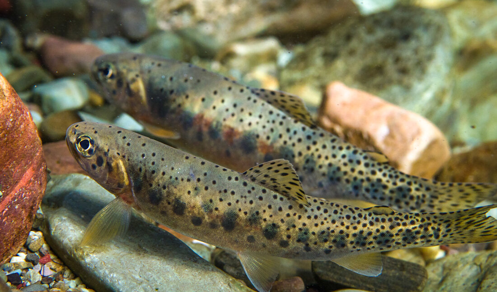

## Executive Summary {-}

The purpose of the Elk River Watershed (Qukin ?amak?is) Connectivity Restoration Plan (WCRP) is to improve understanding of habitat connectivity for Westslope Cutthroat Trout (Oncorhynchus clarkii lewisi) in the Elk River watershed (Qukin ?amak?is) and inform efforts to close knowledge gaps and plan and prioritize restoration. The Elk River watershed is the traditional unceded territory of the Yaq̓it ʔa·knuqⱡi’it First Nation and Ktunaxa Peoples, who have been stewards of the land since time immemorial. The Elk River watershed is known to them as Qukin ?amak?is (Raven’s Land), and we refer to the Elk River watershed as Qukin ?amak?is throughout this document.  

Local data and knowledge are combined with connectivity modelling to estimate current connectivity status and identify structures that potentially block the most habitat. This informs the prioritization of field assessments to close the most significant knowledge gaps efficiently. Information from field assessments of barrier status and habitat condition are incorporated into the model, improving understanding of which barriers block the most habitat, and informing restoration prioritization. As knowledge gaps are closed and barriers are addressed, this plan will be revised to summarize progress and provide updated estimates of connectivity status and the status and relative importance of remaining structures. 

In Qukin ?amak?is upstream of Elko Dam, 756.67 km of Westslope Cutthroat Trout habitat are currently connected and 219.36 km are disconnected. This means that 77.53% of the 976.03 km of total habitat is connected. 

In Qukin ?amak?is downstream of Elko Dam, 208.36 km of Westslope Cutthroat Trout habitat are currently connected and 11.72 km are disconnected. This means that 94.67% of the 220.08 km of total habitat is connected. 

In Qukin ?amak?is upstream of Elko Dam, 216 structures potentially disconnect Westslope Cutthroat Trout habitat. Of these, 15 are identified as barriers in need of rehabilitation (priority barriers), 1 are identified as barriers that do not warrant rehabilitation (non-actionable), and 211 require further field assessment. 

In Qukin ?amak?is downstream of Elko Dam, 15 structures potentially disconnect Westslope Cutthroat Trout habitat. Of these, 3 are identified as barriers in need of rehabilitation (priority barriers), 1 are identified as barriers that do not warrant rehabilitation (non-actionable), and 14 require further field assessment.

![Figure 1: Map of Westslope Cutthroat Trout habitat and structures that are confirmed or potential barriers to fish passage in the Elk River watershed (Qukin ?amak?is) upstream of Elko Dam as of April 2026. Structure data were obtained from BCFishPass the Canadian Aquatic Barriers Database (aquaticbarriers.ca). The accessibility model represents areas of the watershed that Westslope Cutthroat Trout could access naturally in the absence of anthropogenic barriers. The habitat model represents the subset of accessible waterbodies that may be used by Westslope Cutthroat Trout for spawning or rearing. Available local knowledge and data were incorporated and overruled habitat model results. Thick red lines represent habitat considered to be disconnected (upstream of barriers or unassessed structures). Barriers that were rehabilitated through implementation of this plan are shown, but other excluded structures (e.g., those found to be passable) are not.](Fig_1_Elk_upstream_map_2026-04-24.png){fig-cap-location="top"}

![Figure 2: Map of Westslope Cutthroat Trout habitat and structures that are confirmed or potential barriers to fish passage in the Elk River watershed (Qukin ?amak?is) downstream of Elko Dam as of April 2026. Structure data were obtained from BCFishPass the Canadian Aquatic Barriers Database (aquaticbarriers.ca). The accessibility model represents areas of the watershed that Westslope Cutthroat Trout could access naturally in the absence of anthropogenic barriers. The habitat model represents the subset of accessible waterbodies that may be used by Westslope Cutthroat Trout for spawning or rearing. Available local knowledge and data were incorporated and overruled habitat model results. Thick red lines represent habitat considered to be disconnected (upstream of barriers or unassessed structures). Barriers that were rehabilitated through implementation of this plan are shown, but other excluded structures (e.g., those found to be passable) are not.](Fig_2_Elk_downstream_map_2026-04-24.png){fig-cap-location="top"}

![Figure 3: Habitat Accumulation Curve (HAC) showing structures in the Elk River watershed (Qukin ?amak?is) upstream of Elko Dam as of April 2026. Structures are ranked based on how much (km) habitat for Westslope Cutthroat Trout is upstream. The y-axis represents the cumulative amount of potential habitat gain (km). Sets of structures are indicated by a grey line below the curve, indicating that gains from addressing the downstream structure alone would be less than the combined gains from addressing all structures in the set. Habitat upstream of unassessed structures is considered disconnected until field assessments are completed. Structures that were excluded as passable are not shown; however, rehabilitated barriers are shown to demonstrate the connectivity gains achieved through implementation of this plan.](Fig 3_HAC US Elk.png){fig-cap-location="top"}

![Figure 4: Habitat Accumulation Curve (HAC) showing structures in the Elk River watershed (Qukin ?amak?is) downstream of Elko Dam as of April 2026. Structures are ranked based on how much (km) habitat for Westslope Cutthroat Trout is upstream. The y-axis represents the cumulative amount of potential habitat gain (km). Sets of structures are indicated by a grey line below the curve, indicating that gains from addressing the downstream structure alone would be less than the combined gains from addressing all structures in the set. Habitat upstream of unassessed structures is considered disconnected until field assessments are completed. Structures that were excluded as passable are not shown; however, rehabilitated barriers are shown to demonstrate the connectivity gains achieved through implementation of this plan.](content/images/combined_output_alk_below_hac_plot.png){fig-cap-location="top"}

ADD VALUES
This WCRP process was initiated in 2020 with a series of workshops completed with local partners and rightsholders, and the first WCRP was published in 2022. Since inception, the passability of 167 structures has been assessed, and further habitat confirmations were completed at 9 of these. In-depth habitat investigations were also completed for barriers in Brule, Weigert, Lodgepole and Bean creeks, and in select tributaries to Bighorn and Morrissey creeks. Fish passage has been rehabilitated at 2 barriers (unnamed tributary to Lizard Creek at Mount Fernie Park Road and Tobermory Creek at Elk River Main FSR), resulting in improved or restored access to 5.58 km of habitat. Designs for rehabilitating a barrier on Stove Creek in the Lizard Creek drainage have also been completed. 